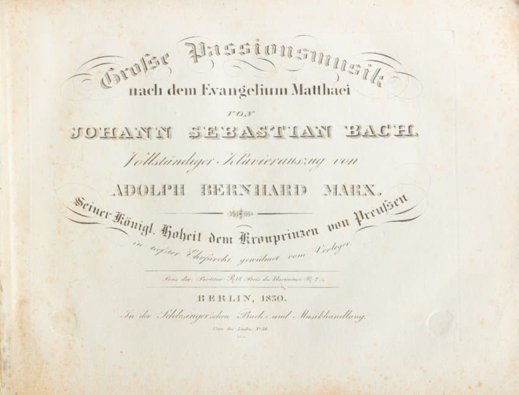
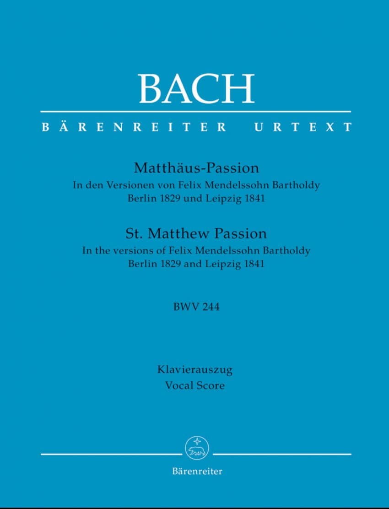

---

title: "10.2 펠릭스 멘델스존 (1)"

category: "낭만·그 이후"

order: 3

source_url: "https://m.dcinside.com/board/digitalpiano/2729"

source_post_no: 2729

images_expected: 2

images_downloaded: 2

status: "complete"

---

<!-- NOTION_SYNCED_TOP: 3b726dfb-cd79-808f-8ad4-d57f791ebb17 -->

펠릭스 멘델스존(1809-1847)은 초기 낭만주의 작곡가로, 바흐의 <마태 수난곡>을 부활시킨 업적으로 음악사에서 중요한 위치를 차지함.

19세기 중반까지 ‘바흐’라는 이름은 거의 연주 프로그램에서 찾아볼 수 없었고, 일부 음악 애호가만 아는 정도였음. 젊은 펠릭스 멘델스존 바르톨디가 괴테의 친구이자 베를린 싱아카데미 지휘자였던 칼 프리드리히 젤터의 지원을 받아, 1829년 3월 11일 베를린에서 <마태 수난곡>을 연주하면서 상황이 급격히 바뀜. 

이는 바흐 사후 80~100년 만에 대중 앞에 선 공연으로, 음악계에 큰 반향과 각성을 불러옴. 이후 바흐 음악의 재조명, 악보 출판, 바흐협회 설립, 작품집 발간 등으로 이어지며 ‘바흐 르네상스’가 시작되었고, 바흐는 유럽 음악의 중심에 재등장하여 오늘날까지 흔들리지 않는 위치를 확보하게 됨.

1830년 베를린에서 멘델스존이 1829년 공연 이후 바흐 <마태 수난곡>의 악보를 출판한 표지. 

멘델스존이 편집한 바헨라이터 출판사의 《Matthäus‑Passion》 악보 표지. 1829년 베를린 시장 공연과 1841년 라이프치히 공연 버전 모두 포함됨.  

멘델스존은 단순히 자료를 보존하고 발견한 것 뿐 아니라, 연주 가능한 형태로 악보를 직접 정리하고, 당시 환경에 맞는 편곡을 통해 더 많은 사람이 다양한 형태로 바흐의 음악을 즐길 수 있게 만듦. 이로 인해 자연스럽게 바흐에 대한 인식의 변화를 가져와 19세기 음악사의 전환점으로 작용했음.

<마태 수난곡> 외에도 다양한 바흐 작품의 발굴 및 연주를 주도함. <요한 수난곡> BWV 245, 바흐의 미사와 칸타타, 푸가·협주곡·실내악 등의 복원과 출판에도 참여함. 런던 등지에서 원전 악보를 수집하고 체계적으로 자료를 정리하여 연주와 공연에 적용함. 

이는 교회음악과 오라토리오 연구 및 연주가 전 세계로 확산되는 계기가 됨.

멘델스존의 기여는 단순히 공연 성사 이상으로, 바흐 음악의 대중화와 연구 문화 형성에 결정적 역할을 함. 슈만, 브람스 등 후대 낭만주의 작곡가들에게 바흐에 대한 존경심과 애정을 심어주고, 바흐가 서양 음악의 토대로 자리매김하는 데 영향을 줌.

[https://www.youtube.com/watch?v=dtSxaT7aerk](https://www.youtube.com/watch?v=dtSxaT7aerk)

2015년에도 토마스 헨니히와 베를린 오라토리엔 합창단은 멘델스존이 1844년에 지휘했던 헨델의 <이스라엘 인 이집트> 공연을 복원했음. 이번에도 동일한 방식으로, 약 190년 전 멘델스존이 연주했던 바로 그 축약판 <마태 수난곡>을 재현함. 

- dc official App

<!-- NOTION_SYNCED_BOTTOM: 2f126dfb-cd79-80c9-b783-d7e85011a79e -->

