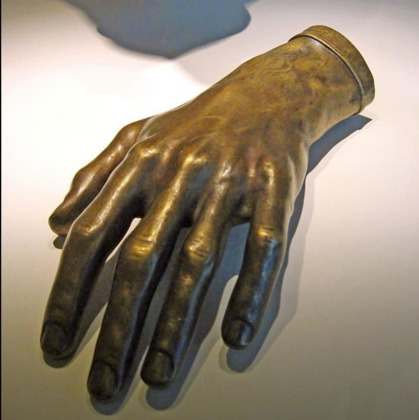

---

title: "11. 프레데리크 쇼팽과 피아노 시학"

category: "낭만·그 이후"

order: 5

source_url: "https://m.dcinside.com/board/digitalpiano/2751"

source_post_no: 2751

images_expected: 1

images_downloaded: 1

status: "complete"

---

<!-- NOTION_SYNCED_TOP: 3b726dfb-cd79-808f-8ad4-d57f791ebb17 -->

낭만주의 시대의 수많은 작곡가들 중에서, 오직 피아노라는 단 하나의 악기에 자신의 전 생애와 예술을 바친 인물이 바로 프레데리크 쇼팽(Frédéric Chopin, 1810-1849)임.

그는 교향곡, 오페라, 오라토리오 등 다른 장르에는 거의 손을 대지 않았고, 처음부터 끝까지 피아노와 함께 시작되고 끝났으며, 이 때문에 그는 역사상 그 누구보다도 피아노의 고유한 특성을 깊이 이해하고 그 가능성을 극한까지 끌어낸 '피아노의 시인'으로 불림.

폴란드 바르샤바에서 태어나 조국에 대한 깊은 사랑을 간직했던 그는, 1830년 러시아의 압제를 피해 파리에 정착한 후 다시는 고국 땅을 밟지 못한 망명객으로 살다감.

그의 음악에 짙게 배어 있는 애수와 비극성, 그리고 폴란드 민속 춤곡에 대한 끝없는 애정은 이러한 그의 삶과 깊이 연결되어 있음.

쇼팽은 리스트처럼 대중을 열광시키는 큰 규모의 콘서트홀의 비르투오소는 아니었음. 섬세하고 내성적인 성격 탓에, 소수의 귀족과 예술가들이 모이는 파리의 ‘살롱(salon)’이라는 개인적인 공간에서 연주하는 것을 선호했음. 그의 음악 역시 거대한 음향이나 현란한 과시보다는, 미묘한 감정의 결, 섬세한 음색의 변화, 그리고 시적인 뉘앙스를 중시함.

- dc official App

<!-- NOTION_SYNCED_BOTTOM: 2f126dfb-cd79-80c9-b783-d7e85011a79e -->

