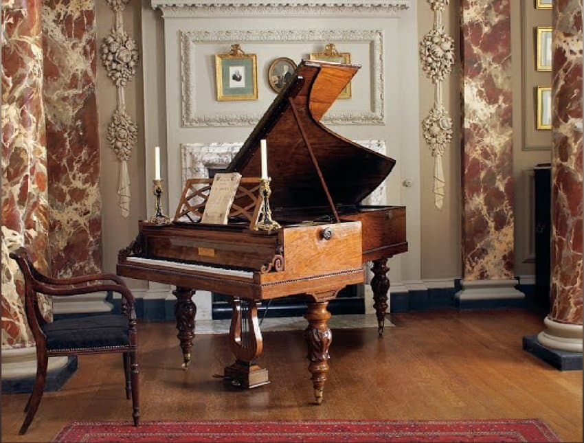

---

title: "11.1. 프레데리크 쇼팽의 새로운 피아노 언어"

category: "낭만·그 이후"

order: 6

source_url: "https://m.dcinside.com/board/digitalpiano/2806"

source_post_no: 2806

images_expected: 2

images_downloaded: 2

status: "complete"

---

<!-- NOTION_SYNCED_TOP: 3b726dfb-cd79-808f-8ad4-d57f791ebb17 -->

프레데리크 쇼팽의 초상화. 외젠 들라크루아 작. 1838년, 프랑스 루브르 박물관 소장.

쇼팽의 음악은 피아노라는 악기와 너무나도 완벽하게 어울려 다른 악기로 편곡하면 그 고유한 매력의 대부분이 사라질 정도임. 이는 그가 피아노의 특성을 기반으로 '사고'하고, 악기의 울림 자체에서 ‘영감’을 얻어 작곡했기 때문임. 그가 창조한 새로운 피아노 언어는 몇 가지 핵심적인 요소로 이루어져 있음.

피아노로 부르는 벨 칸토(Bel Canto)

쇼팽은 이탈리아 오페라, 특히 벨리니(V. Bellini)의 오페라에 심취해 있었음. ‘아름다운 노래’를 뜻하는 벨 칸토 창법의 특징, 즉 길고 부드럽게 흐르는 호흡, 화려하면서도 서정적인 장식음, 그리고 미묘한 감정 표현을 피아노 선율에 그대로 옮김. 

오른손 멜로디에 길고 연속적인 선율, 다양한 장식음, 섬세한 음악적 뉘앙스를 실어 피아노를 성악에 가까운 표현으로 발전시킴.

혁신적인 화성

쇼팽의 화성은 당시 기준으로 매우 대담하고 혁신적이었음. 그는 이전 시대에는 금기시되던 과감한 불협화음과 풍부한 반음계적 진행을 적극적으로 사용하여, 몽환적이거나 불안한, 혹은 격정적인 분위기를 만들어내는 ‘색채적’인 도구로 활용함. 특히, 해결되지 않고 떠도는 듯한 모호한 화음들은 그의 음악에 신비로운 깊이를 더해줌.

관용적인(Idiomatic) 왼손 반주

왼손 반주는 기존의 단순한 알베르티 베이스에서 탈피해 넓은 음역, 아르페지오, 특유의 페달 사용으로 지속적이고 풍부한 배경음향을 구현함. 이는 주선율을 효과적으로 부각하는 역할을 함.

단순히 멜로디를 뒷받침하는 것을 넘어, 페달과 함께 풍부하고 지속적인 음향의 배경을 만들어 멜로디를 자유롭게 표현할 수 있는 바탕을 마련함

템포 루바토(Tempo Rubato)의 적극적인 활용

‘훔친 시간’이라는 뜻의 템포 루바토는 쇼팽 음악의 가장 중요한 특징 중 하나임. 이는 단순히 박자를 마음대로 늘리거나 줄이는 것이 아님. 

쇼팽의 루바토는 종종 왼손의 반주가 비교적 일정한 박자를 유지하는 동안, 오른손의 멜로디가 미묘하게 앞으로 나아가거나 뒤로 머뭇거리며 시간의 긴장과 이완을 만들어내는 것을 의미함. 

“이는 마치 뛰어난 언변으로 감정에 따라 말의 속도를 조절하듯, 음악에 즉흥적이고 인간적인 숨결을 불어넣었다”라고 표현함.

쇼팽이 소유했던 피아노.파리 오를레앙 광장에 있는 그의 살롱의 수채화에 묘사된 피아노로 추정.

쇼팽의 새로운 표현은 그가 선호했던 플레이엘(Pleyel) 피아노와도 밀접한 관련이 있는데, 에라르(Erard) 피아노보다, 터치가 가볍고 음색이 더 섬세하며 서정적인 플레이엘 피아노를 통해 자신의 미묘한 음색 변화와 뉘앙스를 가장 잘 표현할 수 있었음. 

이 모든 요소가 결합하여, 쇼팽은 피아노를 단순한 악기에서 시를 낭송하고 내면을 고백하는 예술의 매체로 격상시켰던 것임.

[https://www.youtube.com/watch?v=3PoSlDhoTJ4](https://www.youtube.com/watch?v=3PoSlDhoTJ4)

쇼팽 탄생 200주년(2010년) 기념 녹음

Fantasy-Impromptu

피아노 : 샘 헤이우드

- dc official App

<!-- NOTION_SYNCED_BOTTOM: 2f126dfb-cd79-80c9-b783-d7e85011a79e -->

