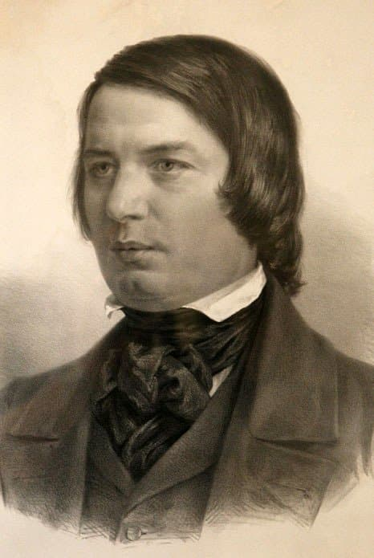

---

title: "12. 로베르트 슈만"

category: "낭만·그 이후"

order: 11

source_url: "https://m.dcinside.com/board/digitalpiano/2942"

source_post_no: 2942

images_expected: 1

images_downloaded: 1

status: "complete"

---

<!-- NOTION_SYNCED_TOP: 3b726dfb-cd79-808f-8ad4-d57f791ebb17 -->

로베르트 슈만은 피아니스트이자 작곡가, 음악 비평가였음. 십대 시절 별명이자 필명으로 쓰던 ‘스퀼란더(Skülander)’ 때문에 알렉산더가 미들 네임이라는 잘못된 이야기가 퍼지기도 함.

아버지가 사전 편찬자이자 번역가, 서점 운영자, 출판업자여서 슈만의 집안은 늘 문학적 분위기에 둘러싸여 있었음. 시인이자 작가인 장 파울 리히터가 슈만의 삶과 미학관에 깊은 영향을 미쳤음.

처음에는 요한 고트프리트 쿤치에게서 음악과 피아노를 배웠고, 이후 프리드리히 비크에게 피아노를 사사함. 비크의 딸 클라라와는 1840년에 결혼했는데, 장인의 반대가 심해서 법정 다툼까지 벌여야 했음.

슈만은 라이프치히, 하이델베르크, 뒤셀도르프, 드레스덴, 빈 등 여러 도시에서 살았음. 1834년에는 음악 잡지 ’신음악잡지(Neue Zeitschrift für Musik)’를 공동 창간하고 편집장으로 활동함.

평생 신경증에 시달렸고 시간이 갈수록 증세가 악화되어 우울증과 심한 피로에 시달림. 여러 번 자살을 생각하기도 했고, 1854년에는 본 근처 엔데니히의 사설 요양원에 입원해서 죽을 때까지 그곳에서 지냄.

수많은 피아노 명작을 남겼는데, 파피용, 아라베스크, 환상소곡집, 카니발, 교향적 연습곡, 크라이슬레리아나, 유모레스크, 노벨레텐, 야상곡, 어린이를 위한 앨범, 소나타들, 그리고 가장 유명한 a단조 피아노 협주곡 등이 있음.

동시대를 살았던 프레데리크 쇼팽이 피아노 자체의 소리와 울림에서 영감을 얻어 순수한 ‘음의 시’를 창조했다면, 로베르트 슈만은 음악 바깥의 세계, 특히 문학에서 영감을 얻어 피아노로 ‘문학적 이야기’를 들려준 작곡가임.

- dc official App

<!-- NOTION_SYNCED_BOTTOM: 2f126dfb-cd79-80c9-b783-d7e85011a79e -->

