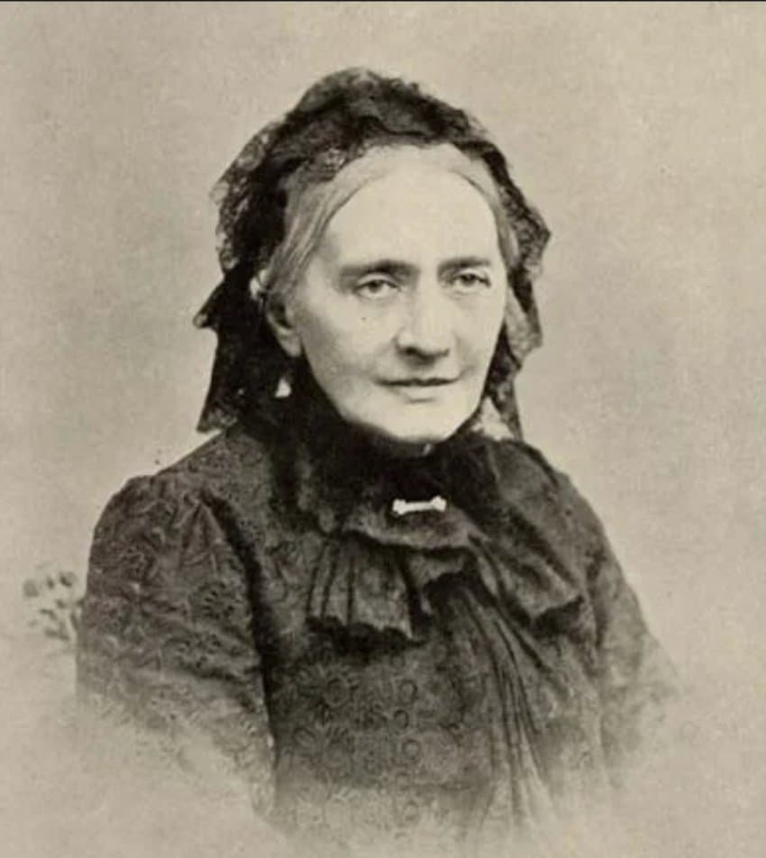
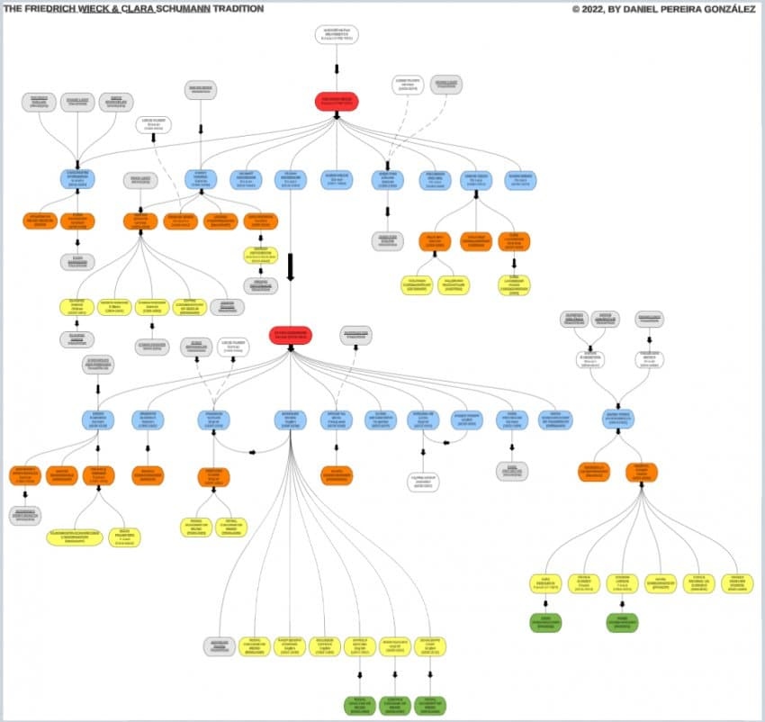
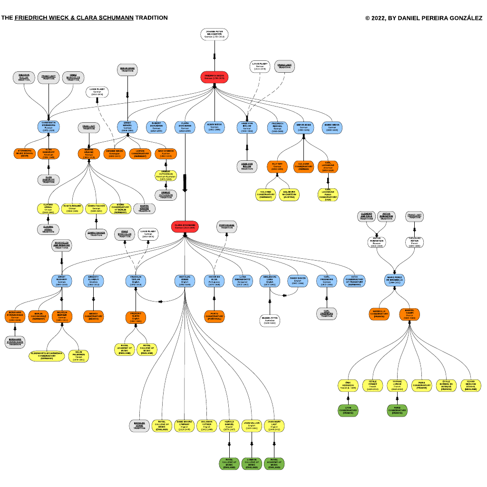

---

title: "클라라 슈만이 현대 피아니스트와 연주회 문화에 미친 결정적인 영향"

category: "낭만·그 이후"

order: 15

source_url: "https://m.dcinside.com/board/digitalpiano/2952"

source_post_no: 2952

images_expected: 3

images_downloaded: 3

status: "complete"

---

<!-- NOTION_SYNCED_TOP: 3b726dfb-cd79-808f-8ad4-d57f791ebb17 -->

클라라 슈만은 현대 피아니스트와 피아노 문화에 결정적인 영향을 미친 인물임.

**연주 및 교육 방식의 혁신**

- 가장 먼저 피아노 연주회에서 악보 없이 '암보 연주'를 본격적으로 도입한 인물 중 한 명으로 꼽히며, 이 전통이 현대까지 표준으로 자리잡음.(1830년대 후반으로 추정)

- 연주 프로그램을 화려한 기교 위주에서 역사적·예술적 가치 중심으로 전환, 바흐, 스카를라티, 베토벤, 쇼팽 등 ‘진지한 음악’의 비중을 높여 현대 피아니스트들이 고전 프로그램을 중시하는 흐름에 깊은 영향을 줌.

- 즉흥성과 표현력에 치중한 ‘노래하는 톤’과 감정을 중시하는 교육법을 확립, 이를 제자와 2세대 제자를 통해 영국, 미국, 유럽 전역으로 확산시킴. 대표적으로 칼 프리트베르크, 마틸드 베르네, 파니 데이비스 등이 있음.

[**The Frederick Wieck and Clara Schumann Tradition: Lucidchart**](https://lucid.app/documents/embeddedchart/83381eec-4784-427f-9558-3b4323a517c1#)

[Check out my Lucidchart document! Lucidchart is the intelligent diagramming solution that empowers teams to clarify complexity, align their insights, and build the future faster. Create your own diagram or flowchart at lucidchart.com.](https://lucid.app/documents/embeddedchart/83381eec-4784-427f-9558-3b4323a517c1#)

[lucid.app](https://lucid.app/documents/embeddedchart/83381eec-4784-427f-9558-3b4323a517c1#)

그녀의 아버지 프리드리히 비크와 클라라 슈만이 형성한 비크-슈만 계보.

**고유의 예술적, 문화적 기여**

- 로베르트 슈만, 멘델스존, 브람스 등 동시대 및 후대 작곡가들을 적극적으로 연주하고 보급하면서 레퍼토리에 자리잡게 함. 특히 남편 슈만의 작품과 그의 음악 세계를 유럽 전역에 퍼뜨리는 데 결정적 역할.

- 자신의 작품(피아노 협주곡, 소나타, 변주곡, 피아노 트리오 등)은 독보적 감성과 대담한 구조적 실험으로 현대에 재평가되고 있음. 여성 작곡가로서의 당시의 관습을 넘어선 위상과 창조성을 보여줌.

- 연주자의 해석과 프로그램 편성에 있어 ‘미니어처’와 모자이크적 구성 등 창의적 접근을 도입, 미니어처는 짧고 개성적인 소품이고, 모자이크적 구성은 그런 소품들을 다채롭게 엮어서 하나의 프로그램이나 작품집을 만든 형태임. 클라라 슈만이 이 방식을 적극적으로 활용하면서 현대적 연주회 편성 및 concepts의 기반을 닦음.

클라라 슈만은 암보 연주 관행 정착, 진지한 음악 중심 프로그램 전통, 감정과 표현 중시 교육, 동시대 음악 유산의 관리와 확산 등에서 현대 피아니스트에게 지대한 영향을 남김. 여성 음악가의 지위와 창조적 예술성도 클라라 고유의 공헌으로 평가됨.

아래 참고

[https://exhibitions.lib.umd.edu/piano-genealogies/pianist-bios/wieck-schumann-tradition](https://exhibitions.lib.umd.edu/piano-genealogies/pianist-bios/wieck-schumann-tradition)

- dc official App

<!-- NOTION_SYNCED_BOTTOM: 2f126dfb-cd79-80c9-b783-d7e85011a79e -->

