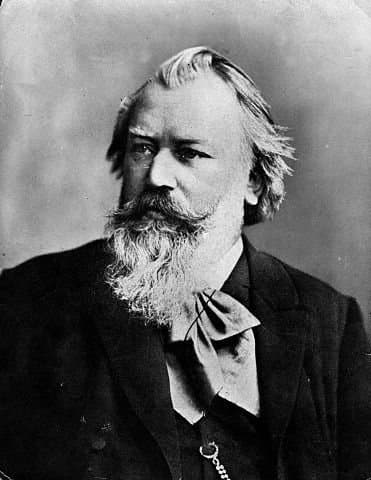

---

title: "14. ‘절대음악’의 가치와 브람스"

category: "낭만·그 이후"

order: 22

source_url: "https://m.dcinside.com/board/digitalpiano/3136"

source_post_no: 3136

images_expected: 1

images_downloaded: 1

status: "complete"

---

<!-- NOTION_SYNCED_TOP: 3b726dfb-cd79-808f-8ad4-d57f791ebb17 -->

19세기 중반, 낭만주의 음악은 크게 두 갈래로 나뉘어 흐름.

리스트와 바그너를 중심으로, 문학이나 회화와 같은 외부의 아이디어와 결합하는 ‘표제음악(Program Music)’과 새로운 형식(교향시 등)을 추구했던 ‘**신독일 악파(New German School)**’임.

그런데, 이러한 흐름에 반대하며 음악 자체의 형식과 논리, 즉 ‘**절대 음악(Absolute Music)**’의 가치를 옹호하는 보수적인 흐름이 있었음. 베토벤과 고전주의 대가들이 완성한 소나타, 교향곡, 실내악과 같은 전통적인 형식이 여전히 심오한 감정을 표현할 수 있는 가장 완벽한 형태라고 생각함. 

이런 보수적 낭만주의의 중심이 요하네스 브람스(Johannes Brahms, 1833-1897)임.

브람스는 낭만주의 시대의 풍부한 화성과 서정성을 바탕으로 하면서도, 바흐의 대위법과 베토벤의 구조적 엄격함을 결합하여 논리적이고 견고한 음악을 만들어냄. 그래서 브람스의 음악은 전반적으로 감성을 지성으로 통제하는 듯한 독특한 매력을 보인다고 평가됨.

- dc official App

<!-- NOTION_SYNCED_BOTTOM: 2f126dfb-cd79-80c9-b783-d7e85011a79e -->

