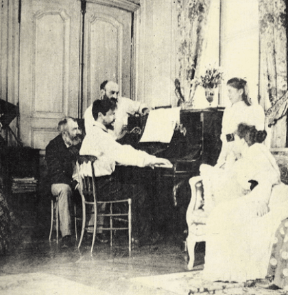

---

title: "16.2. 드뷔시의 주요 피아노 작품"

category: "낭만·그 이후"

order: 34

source_url: "https://m.dcinside.com/board/digitalpiano/3445"

source_post_no: 3445

images_expected: 1

images_downloaded: 1

status: "complete"

---

<!-- NOTION_SYNCED_TOP: 3b726dfb-cd79-808f-8ad4-d57f791ebb17 -->

피아노를 연주하는 드뷔시. 1893년

드뷔시는 자신이 제시한 새로운 화성 체계를 바탕으로, 전주곡, 영상, 베르가마스크 모음곡 등을 남김.

그는 피아노를 ‘해머가 없는 현악기’처럼 다루고자 했으며, 서스테인 페달의 적극적인 사용을 통해 소리를 여러 레이어로 섞고, 음향의 잔향을 활용하여 ‘분위기’를 만들어내는 데 집중함. 

그의 주요 피아노 작품들은 작곡 시기순으로 뚜렷한 양식적 발전을 보여줌.

초기, 베르가마스크 모음곡 (Suite bergamasque)

1890년대에 작곡을 시작하여 1905년에 출판된 이 초기 모음곡은, 18세기 프랑스 클라브생 악파(쿠프랭, 라모)의 우아한 형식미를 자신만의 방식으로 재해석하려는 시도를 보여줌. ‘전주곡’, ‘미뉴에트’, ‘파스피에’와 같은 바로크풍의 악장 제목을 사용하지만, 그 내용은 전통 화성에서 벗어난 모호하고 몽환적인 화성으로 채워져 있음. 

이 모음곡에 포함된 3악장 달빛(Clair de lune)은 드뷔시의 모든 작품을 통틀어 가장 유명한 곡으로, 시인 폴 베를렌의 시에서 영감을 얻어 달빛 아래의 신비로운 풍경을 소리로 그려냄.

인상주의 양식의 확립, 판화 (Estampes)와 영상 (Images) 

1900년대 초반에 작곡된 이 두 모음곡은 드뷔시의 인상주의 피아노 스타일이 완전히 확립되었음을 보여줌. 각 곡은 특정 장소나 시각적 이미지에서 받은 순간적인 인상을 소리로 포착해 음향 회화와 같은 느낌을 줌.

판화 (1903)

1번 탑(Pagodes)은 파리 만국박람회에서 들었던 자바 가믈란 음악의 음향을 5음 음계와 층층이 쌓이는 듯한 리듬으로 재현함. 

2번 그라나다의 황혼에서는 하바네라 리듬을 사용하여 이국적인 스페인의 정취를, 3번 비 오는 정원에서는 프랑스 동요 선율 위로 쏟아지는 비의 풍경을 기교적으로 묘사함.

영상 1, 2집 (1905, 1907)

1집의 1번 물에 비친 그림자(Reflets dans l’eau)는 잔물결 위로 어른거리는 빛의 반사를 표현하기 위해 피아노의 모든 음역에 걸친 아르페지오와 분산화음을 사용하여, 인상주의의 특징을 보여줌.

2집의 1번 잎새를 스치는 종소리나 3번 금빛 물고기(일본 칠기에서 영감) 역시 시각적 이미지를 음향으로 들려주려는 시도임.

인상주의의 정점, 전주곡 (Préludes) 1, 2권

1910년에서 1913년 사이에 작곡된 총 24개의 전주곡은 드뷔시 피아노 음악의 최고 작품이자 인상주의 음악의 특징을 모두 보여주는 작품이라고 할 수 있음.

제목의 배치

드뷔시는 쇼팽의 전주곡처럼 각 곡에 표제적인 제목을 붙였지만(델포이의 무희들, 서풍이 본 것, 아마빛 머리의 소녀), 악보의 맨 앞에 제목을 쓰는 대신, 곡이 끝난 뒤 맨 마지막에 괄호 안에 적어 넣었음. 이는 청중이 선입견 없이 음악을 순수한 소리 자체로 먼저 경험한 뒤, 그 제목을 시적인 암시로 참고하기를 바랐던 그의 의도를 보여줌.

다양한내용

24개의 곡들은 온음 음계, 5음 음계, 교회 선법 등 그가 사용했던 모든 음악 어법을 총망라하며, 신화적 상상력에서부터 일상적인 풍경, 유머, 그리고 순수한 음향의 탐구에 이르기까지 폭넓은 내용을 담고 있음.

후기 양식, 12개의 연습곡 (Études)

1915년에 작곡된 마지막 대규모 피아노 작품. 쇼팽에게 헌정된 이 작품은 이전의 회화적인 묘사에서 벗어나, 5개의 손가락을 위하여, 3도를 위하여, 8개의 손가락을 위하여 등 순수하게 피아노의 기술적, 음향적 문제를 다루나, 음악은 대체로 추상적인 경향을 보임.

[https://www.youtube.com/watch?v=97\_VJve7UVc](https://www.youtube.com/watch?v=97_VJve7UVc)

드뷔시, 베르가마스크 모음곡 중 달빛(Clair de lune)

피아노 : 조성진

- dc official App

<!-- NOTION_SYNCED_BOTTOM: 2f126dfb-cd79-80c9-b783-d7e85011a79e -->

