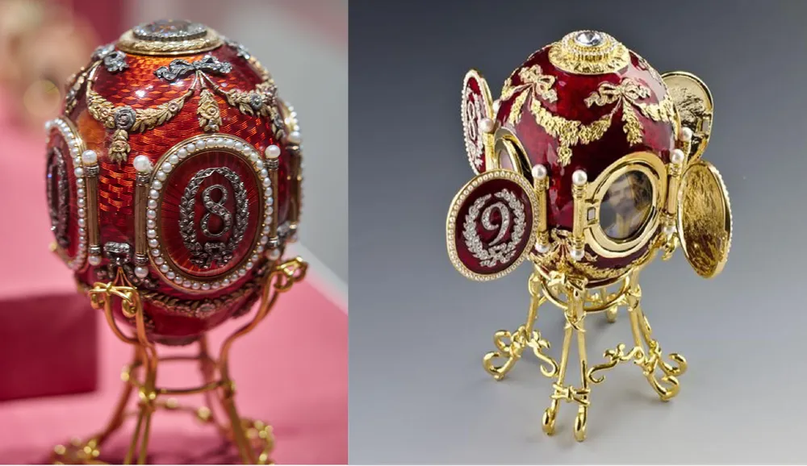

---

title: "17. 후기 낭만주의와 신비주의"

category: "낭만·그 이후"

order: 37

source_url: "https://m.dcinside.com/board/digitalpiano/3495"

source_post_no: 3495

images_expected: 1

images_downloaded: 1

status: "complete"

---

<!-- NOTION_SYNCED_TOP: 3b726dfb-cd79-808f-8ad4-d57f791ebb17 -->

20세기가 시작될 무렵, 러시아에서는 19세기 낭만주의의 전통이 마지막을 불태우고 있었음.

특히 모스크바 음악원을 중심으로 한 러시아의 피아니즘은 쇼팽과 리스트의 계통을 이어받아, 슬라브적인 깊은 감수성과 테크닉의 결합으로 독자적인 세계를 구축함.

이 시기 러시아 예술계는 상징주의와 신비주의가 만개했던 ‘은(銀)의 시대’로 불리며, 이런 시대정신은 음악에도 깊이 반영됨.

이 흐름의 중심에는 세르게이 라흐마니노프와 알렉산드르 스크리아빈이 있음.

라흐마니노프는 차이콥스키로부터 이어지는 러시아 낭만주의의 정통 계승자로서, 20세기의 모더니즘 흐름에 동참하기를 거부하고 19세기의 전통 안에서 자신만의 음악을 완성함.

반면, 스크리아빈은 전통보다는 새로운 변화를 추구한 작곡가로, 주로 쇼팽의 영향에서 출발했지만, 점차 신지학(Theosophy)과 같은 신비주의 철학에 심취하여 음악을 통해 인류를 영적인 황홀경으로 이끌고자 하는 독창적이고 혁신적인 음악을 이룸.

\*사진은 1893년 정교회 부활절을 기념해 제작된 황실 달걀. 알렉산드르 3세가 마리야 표도로브나 황후를 위해 만든 선물.

- dc official App

<!-- NOTION_SYNCED_BOTTOM: 2f126dfb-cd79-80c9-b783-d7e85011a79e -->

