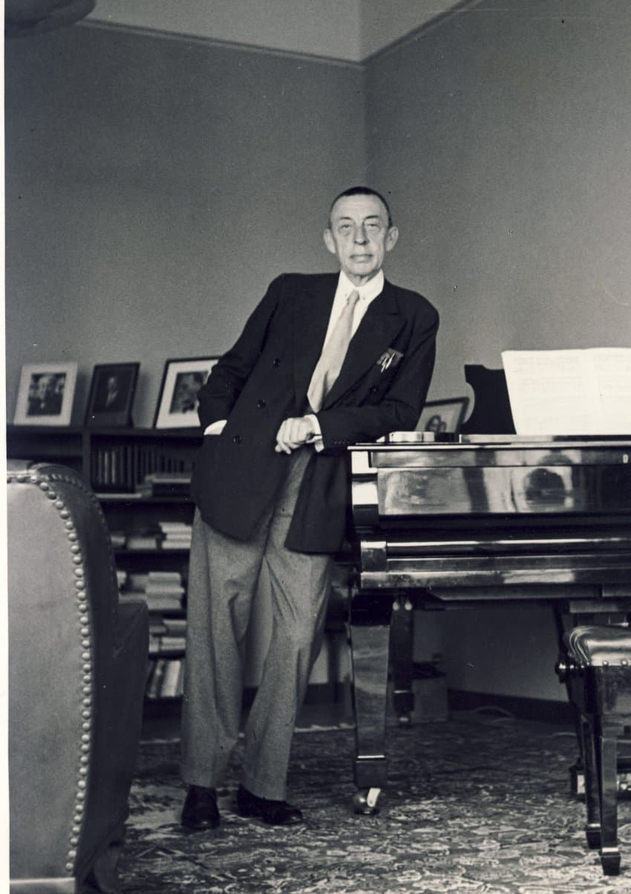
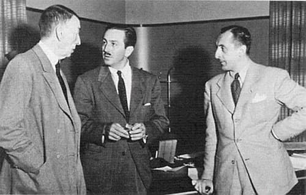

---

title: "17.1. 세르게이 라흐마니노프와 러시아 낭만주의"

category: "낭만·그 이후"

order: 38

source_url: "https://m.dcinside.com/board/digitalpiano/3511"

source_post_no: 3511

images_expected: 3

images_downloaded: 3

status: "complete"

---

<!-- NOTION_SYNCED_TOP: 3b726dfb-cd79-808f-8ad4-d57f791ebb17 -->

세르게이 라흐마니노프(Sergei Rachmaninoff, 1873-1943)

라흐마니노프는 역사상 가장 위대한 피아니스트 중 한 명이자, 19세기 낭만주의 음악의 전통을 20세기 중반까지 이어간 마지막 낭만주의자였음. 

그는 스트라빈스키의 원시주의나 쇤베르크의 무조성 음악과 같은 20세기의 급진적인 모더니즘 흐름 속에서도, 조성과 서정적인 선율에 대한 자신의 신념을 굳건히 지켰음. 

그의 음악은 쇼팽의 시적인 선율, 리스트의 화려한 기교, 그리고 차이콥스키의 애수 어린 감수성을 모두 이어나가고, 여기에 러시아 정교회의 종소리와 광활한 대지의 이미지를 더한 독자적인 음악을 구축함.

사진: 좌측으로부터 라흐마니노프, 디즈니, 호로비츠

라흐마니노프 피아니즘의 특징

러시아 정교회 성가와 종소리의 영향

그의 음악에서 가장 두드러지는 특징 중 하나는 러시아 정교회 성가의 길고 장중한 선율선과, 크렘린의 종들이 울리는 듯한 깊고 풍부한 화성적 울림임. 그는 피아노의 낮은 음역대를 사용하여 거대한 종이 울리는 듯한 음향을 만들어내는 데 탁월했으며, 이는 그의 음악에 러시아적인 장대함과 비장미를 부여함.

길게 이어지는 선율: 그의 선율은 짧은 동기의 발전보다는, 매우 긴 호흡으로 끊어질 듯 이어지며 점차적으로 고조되는 거대한 흐름을 만들어냄. 이러한 서정성은 그의 음악이 가진 가장 큰 매력임.

독창적인 피아노 텍스처

라흐마니노프는 역사상 가장 큰 손을 가진 피아니스트 중 한 명으로 알려져 있으며, 이러한 신체적 특징은 그의 작곡에 그대로 반영됨. 그의 피아노곡들은 한 옥타브를 훌쩍 넘는 넓은 음역에 걸친 화음, 여러 성부가 복잡하게 얽힌 빽빽한 텍스처, 그리고 강력한 힘과 지구력을 요구하는 화려한 패시지로 가득 차 있음.

총체적 기교

그의 음악은 리스트적인 화려한 옥타브나 아르페지오뿐만 아니라, 쇼팽적인 섬세한 장식음과 칸타빌레 표현, 그리고 바흐적인 대위법적 성부 진행까지, 피아노로 구현할 수 있는 거의 모든 종류의 기교를 요구하는 총체적 피아니즘의 정점을 보여줌.

라흐마니노프의 음악적 태도는 보수적으로 보일 수 있으나, 그는 낭만주의라는 기존의 틀 안에서 자신만의 독창적인 목소리를 찾아낸 작곡가였음. 그의 음악은 시대를 초월하여 오늘날까지도 전 세계 클래식 애호가들에게 가장 큰 사랑을 받는 레퍼토리 중 하나로 남아있으며, 이는 그의 음악이 가진 진솔한 감정적 호소력과 압도적인 피아니즘의 힘을 증명하는 것임.

[https://www.youtube.com/watch?v=qnEfzOHdOXM](https://www.youtube.com/watch?v=qnEfzOHdOXM)

세르게이 라흐마니노프 - 전주곡 C#단조, Op.3, No.2 (모스크바의 종소리를 연상시키는 장중한 도입부와 격렬한 중간부가 특징인, 그의 명성을 처음으로 알린 작품)Op.3, No.2

피아노 : 루간스키

- dc official App

<!-- NOTION_SYNCED_BOTTOM: 2f126dfb-cd79-80c9-b783-d7e85011a79e -->

