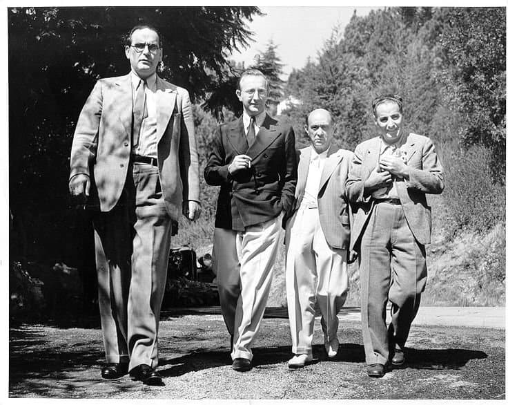

---

title: "18. 조성의 해체와 제2 빈 악파"

category: "낭만·그 이후"

order: 42

source_url: "https://m.dcinside.com/board/digitalpiano/3622"

source_post_no: 3622

images_expected: 1

images_downloaded: 1

status: "complete"

---

<!-- NOTION_SYNCED_TOP: 3b726dfb-cd79-808f-8ad4-d57f791ebb17 -->

20세기 초, 예술계는 지난 세기의 낭만주의에 대한 근본적인 회의와 반작용으로 급격한 변화를 맞이함. 사진 기술의 발달로 사실적 재현의 의미가 사라진 미술계에서 입체파와 추상화가 등장했듯, 음악계에서도 바그너와 드뷔시 등에 의해 한계까지 도달한 조성(tonality) 체계가 마침내 붕괴하는, 역사상 가장 급진적인 혁명이 일어남.

지난 300년간 서양 음악의 문법이자 질서였던 ‘조성’, 즉 으뜸음이 존재하고 화음이 기능에 따라 긴장과 해결을 반복하는 시스템이 더 이상 유일한 진리가 아니라고 선언한 셈임.

그 시작은 아이러니하게도 하이든, 모차르트, 베토벤의 ‘제1 빈 악파’가 활동했던 고전의 중심 빈(Vienna)이었음.

아르놀트 쇤베르크와 그의 두 제자 알반 베르크, 안톤 베베른으로 구성된 제2 빈 악파는, 스스로를 독일 고전-낭만주의의 정통 계승자로 칭하고, 낭만주의의 극단적인 반음계주의를 논리적으로 완성해 ‘무조성(atonality)’이라는 새로운 음악 체계를 완성했다고 주장함.

음색이 섞이는 오케스트라와 달리, 피아노의 명확한 음정은 새로운 화성과 구조를 시험하기에 가장 적합했기 때문에, 피아노는 이 새로운 무조성을 실험하고 완성하는 데 있어 가장 중요한 악기였음. 

- dc official App

<!-- NOTION_SYNCED_BOTTOM: 2f126dfb-cd79-80c9-b783-d7e85011a79e -->

