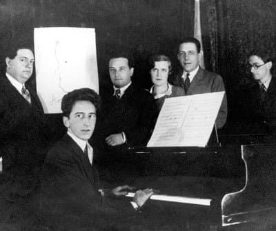

---

title: "20.1. 프랑스 6인조(Les Six)와 에릭 사티의 영향"

category: "낭만·그 이후"

order: 52

source_url: "https://m.dcinside.com/board/digitalpiano/3880"

source_post_no: 3880

images_expected: 1

images_downloaded: 1

status: "complete"

---

<!-- NOTION_SYNCED_TOP: 3b726dfb-cd79-808f-8ad4-d57f791ebb17 -->

프랑스 파리를 중심으로 활동했던 프랑스 6인조(Les Six)는 1차 세계대전 직후, 낭만주의와 드뷔시의 인상주의에 반발하며 등장했음. 

이들은 간결함, 명료함, 그리고 일상과의 연결을 중시하는 새로운 프랑스 음악을 창조하고자 했음.

반(反)낭만주의와 유머

- 정신적 지주

이들의 정신적 지주는 에릭 사티(Erik Satie)였음. 사티는 이미 19세기 말부터 낭만주의의 과장된 감정을 풍자하고 음악의 객관성을 주장했으며, 가구 음악(Musique d’ameublement)이라는 개념을 통해 음악의 일상성을 강조했음.

- 객관주의와 유머

6인조는 사티의 영향을 받아 음악에 아이러니와 유머를 담았으며, 발레, 서커스, 재즈 등 당대의 대중 문화 요소를 적극적으로 수용함.

대표 작곡가

6명 중 피아노 음악에서 중요한 역할을 한 작곡가는 다리우스 미요(Darius Milhaud)와 프랑시스 풀랑크(Francis Poulenc)임.

주요 피아노 작품

**프랑시스 풀랑크 (Francis Poulenc, 1899-1963)**

- 특징: 6인조 중 가장 서정적이지만, 그 서정성은 낭만주의와 달리 객관적이고 절제된 형태로 나타남. 그의 피아노 소품들(예: 즉흥곡(Improvisation) 시리즈와 프롬나드(Promenades))은 간결하고 우아하며, 재즈와 파리 특유의 경쾌함이 섞인 신고전주의의 우아한 면모를 보여줌.

**다리우스 미요 (Darius Milhaud, 1892-1974)**

- 특징: 브라질의 리듬과 미국의 재즈를 과감하게 수용했으며, 복조(Polytonality)를 가장 적극적으로 사용한 작곡가 중 한 명임. 그의 피아노 음악(예: '브라질의 추억' 시리즈나 '브라질 무곡(Saudades do Brasil)' 중 일부)은 복조가 만들어내는 독특한 불협화음 속에서도 명쾌하고 경쾌한 리듬을 유지하며 신고전주의의 실험적인 측면을 보여줌.

[https://www.youtube.com/watch?v=zZanU1ZaN6k](https://www.youtube.com/watch?v=zZanU1ZaN6k)

다리우스 미요의 Saudades do Brasil

- dc official App

<!-- NOTION_SYNCED_BOTTOM: 2f126dfb-cd79-80c9-b783-d7e85011a79e -->

