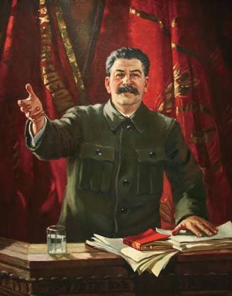

---

title: "21. 소비에트 연방의 작곡가들"

category: "낭만·그 이후"

order: 54

source_url: "https://m.dcinside.com/board/digitalpiano/3902"

source_post_no: 3902

images_expected: 1

images_downloaded: 1

status: "complete"

---

<!-- NOTION_SYNCED_TOP: 3b726dfb-cd79-808f-8ad4-d57f791ebb17 -->

1917년 러시아 혁명 이후 수립된 소비에트 연방(소련)은 서유럽과는 완전히 다른 독자적인 예술 노선을 걷게 됨. 국가가 예술의 방향성을 직접 통제하는 강력한 이데올로기 아래, 작곡가들은 사회주의 리얼리즘(Socialist Realism)이라는 예술 강령을 따라야 했기 때문임.

쇤베르크의 12음 기법이나 서유럽의 아방가르드 실험처럼 음악이 난해하고 추상적인 형식주의(Formalism)로 흘러가는 것을 배척하고, 대중이 쉽게 이해할 수 있으며 국가의 이념(혁명, 노동, 애국심, 영웅주의)을 고취하는 내용을 담아야 함을 의미했음.

이러한 특수한 환경 때문에 서유럽의 모더니즘과는 구별되는 독특한 음악적 발전을 낳았음. 작곡가들은 당의 요구(대중성, 영웅성)와 자신의 예술적 양심(현대성, 개인적 표현) 사이에서 끊임없이 갈등하고 타협해야 했음.

피아노 음악 역시 이러한 경향을 반영함. 이 시기를 대표하는 두 거장은 세르게이 프로코피예프와 드미트리 쇼스타코비치임.

[https://youtu.be/qEA4xcSe0dA?si=b5Bz0ioSDnLJOtmj](https://youtu.be/qEA4xcSe0dA?si=b5Bz0ioSDnLJOtmj)

아람 하차투리안 (Aram Khachaturian) 토카타 (Toccata in E-flat minor) (1932)

아람 하차투리안은 소련이 요구한 내용을 완벽하게 갖춘 작곡가로 

대중성, 노동/산업의 표현과 공산당의 영웅성을 압도적인 기교와 화려함으로 표현한 소비에트 토카타의 전형임.

- dc official App

<!-- NOTION_SYNCED_BOTTOM: 2f126dfb-cd79-80c9-b783-d7e85011a79e -->

