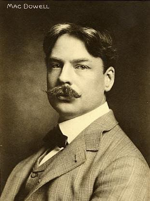

---

title: "22. 미국 피아노 음악"

category: "낭만·그 이후"

order: 57

source_url: "https://m.dcinside.com/board/digitalpiano/3993"

source_post_no: 3993

images_expected: 1

images_downloaded: 1

status: "complete"

---

<!-- NOTION_SYNCED_TOP: 3b726dfb-cd79-808f-8ad4-d57f791ebb17 -->

미국 낭만주의의 상징. 에드워드 맥도웰

19세기 말까지 미국의 클래식 음악은 유럽, 그중에서도 독일 낭만주의의 영향 아래 있었음. 에드워드 맥도웰(Edward MacDowell) 같은 작곡가들이 있었지만, 여전히 유럽의 작풍을 답습하는 수준에 머물렀음. 

그러나 20세기에 들어서며 급격한 산업화와 다문화 사회의 형성을 통해 유럽과는 다른 독자적인 정체성이 나타나기 시작함.

미국 피아노 음악의 성장은 크게 두 가지 흐름으로 요약됨.

1. 실험주의(Experimentalism)

유럽의 전통적인 화성법과 형식을 완전히 무시하고, 소음(Noise), 불협화음, 새로운 주법을 과감하게 도입한 흐름 (찰스 아이브스, 헨리 카웰).

2. 미국적 색채의 확립(American Sound)

흑인 영가, 재즈, 카우보이 노래 등 미국의 토착적인 소재를 클래식 양식과 결합하여 대중적이고 고유한 스타일을 구축한 흐름 (조지 거슈윈, 에런 코플런드).

[https://www.youtube.com/watch?v=qVxKM\_6d\_Rg](https://www.youtube.com/watch?v=qVxKM_6d_Rg)

에드워드 맥도웰 - 

숲속의 스케치 (Woodland Sketches), Op. 51 중 제1곡 야생 장미에게 (To a Wild Rose)

- dc official App

<!-- NOTION_SYNCED_BOTTOM: 2f126dfb-cd79-80c9-b783-d7e85011a79e -->

