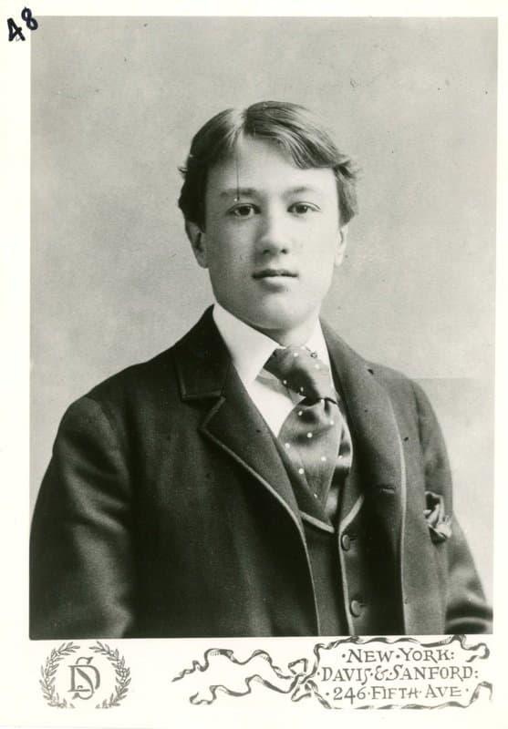

---

title: "22.2. 찰스 아이브스의 실험적 피아노 음악과 콩코드 소나타"

category: "낭만·그 이후"

order: 59

source_url: "https://m.dcinside.com/board/digitalpiano/4037"

source_post_no: 4037

images_expected: 2

images_downloaded: 2

status: "complete"

---

<!-- NOTION_SYNCED_TOP: 3b726dfb-cd79-808f-8ad4-d57f791ebb17 -->

찰스 아이브스(Charles Ives, 1874-1954)는 전편의 카웰과 동료이자 스승이기도 함. 

아이브스는 독특한 이력을 가지고 있는데, 성공한 보험 회사 임원으로 일하며, 퇴근 후나 주말에만 작곡을 했음.

아이브스의 음악은 실험성과 토속성 두 가지로 대표되는데, 실험성 면에서 보았을 때 무조성 뿐 아니라 다양한 리듬 등을 시도했고 후대에선 이를 수십 년 앞선 선구안이 있다고 평가함. 또한 동부 뉴잉글랜드의 문화, 예술에 기반한 토속성을 실험하면서 선구자의 길을 걸었음. 

이것은 아이브스가 음악으로 돈을 벌 필요가 없었기에 청중이나 비평가의 눈치를 보지 않고 시대를 수십 년 앞서간 급진적인 실험을 감행할 수 있었던 것이 아닐까 생각함.

콜라주와 동시성

아이브스의 음악적 철학은 서로 관련 없는 사건들이 동시에 일어나는 것이었음. 이를 해석하고 연주하기 위해 연주자는 극도의 난해함을 토로함.

인용과 콜라주

그는 베토벤의 교향곡, 찬송가, 군악대의 행진곡, 술집의 래그타임 등 이질적인 재료들을 한 곡 안에 섞어서 피아니스트는 진지한 클래식 연주와 시골 밴드의 엇나가는 리듬을 동시에 표현해야 했음.

복조성과 복리듬

마치 두 개의 서로 다른 밴드가 거리에서 마주쳐 지나갈 때 들리는 소음처럼, 왼손과 오른손이 서로 다른 조성과 박자로 연주되는 경우가 허다함. 이는 다성부 음악이나 복잡한 폴리리듬이 주는것과는

또다른 고도의 독립적인 손가락 테크닉을 요구함.

피아노 소나타 제2번 콩코드, 매사추세츠 1840-1860

그의 대표작인 콩코드 소나타는 19세기 미국 초월주의 철학가들(에머슨, 호손, 올콧, 소로)을 묘사한 4악장의 작품임.

- 톤 클러스터(Tone Cluster)의 사용: 제2악장 호손에서 아이브스는 건반을 손가락이 아닌, 14와 3/4인치 길이의 나무 막대로 눌러 연주 할 것을 지시함. 이는 선율을 무시하고 음향 덩어리에만 집중한 최초의 시도 중 하나였음.

- 곡 전반에 걸쳐 베토벤 교향곡 5번의 모티브가 집요하게 인용되는데, 아이브스는 인간의 운명과 의지에 대한 철학적 질문이라고 함.

아이브스는 피아노를 통해 아름다운 소리가 아닌, 삶의 복잡함과 거친 진실을 있는 그대로 담아내려 했고, 악보 또한 정돈되지 않은 야생 그 자체임.

덧붙여 아이브스의 또다른 업적은 생명보험 패키지임. 그의 음악에서 얻은 융합 사고를 복잡한 리스크 계산 모델에 적용해 보험 산업의 정확성과 효율성을 크게 향상함. 당시 부유층은 상속에 대한 고민이 많았는데 아이브스는 부유층의 자산을 관리하고 상속하는 과정을 체계화해 세금을 최소화하고 자산가치를 극대화하는 방법을 고안함.

아이브스가 쓴 상속세 관련 생명보험 책은 업계에서 호평을 받으면서 상당한 인정을 받았음. 이를 통해 상당한 수익을 올리며, 아무도 출판해주려 하지 않은 자신의 음악을 자비로 출판함.

[https://youtu.be/cDNPpsUaVYo?si=pvqMR\_ny7phB4\_JX](https://youtu.be/cDNPpsUaVYo?si=pvqMR_ny7phB4_JX)

찰스 아이브스 - 피아노 소나타 제2번 '콩코드' 중 2악장 '호손(Hawthorne)'

- dc official App

<!-- NOTION_SYNCED_BOTTOM: 2f126dfb-cd79-80c9-b783-d7e85011a79e -->

