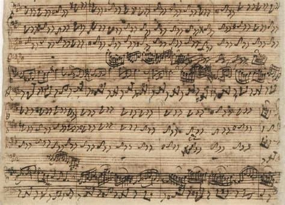

---

title: "1. 피아노 이전의 건반 악기들"

category: "바로크·고전"

order: 1

source_url: "https://m.dcinside.com/board/digitalpiano/1909"

source_post_no: 1909

images_expected: 1

images_downloaded: 1

status: "complete"

---

<!-- NOTION_SYNCED_TOP: 3b726dfb-cd79-808f-8ad4-d57f791ebb17 -->

바흐 Dminor  BWV 1052 쳄발로 협주곡 자필 악보

18세기 초반, 오늘날과 같은 피아노는 아직 음악사의 주역이 아니었음. 당시 유럽의 건반 음악 세계를 지배한 악기는 하프시코드(Harpsichord)와 클라비코드(Clavichord)였음. 이 두 악기는 구조와 음향적 특성, 그리고 사용 목적에서 뚜렷한 차이를 보이며 바로크 시대 음악의 양상을 결정하는 중요한 역할을 담당함.

- dc official App

<!-- NOTION_SYNCED_BOTTOM: 2f126dfb-cd79-80c9-b783-d7e85011a79e -->

