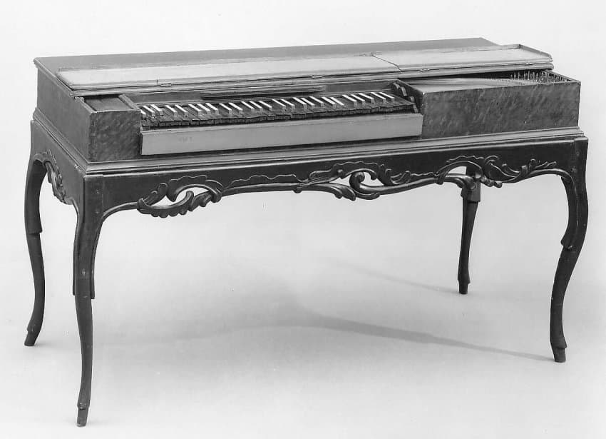
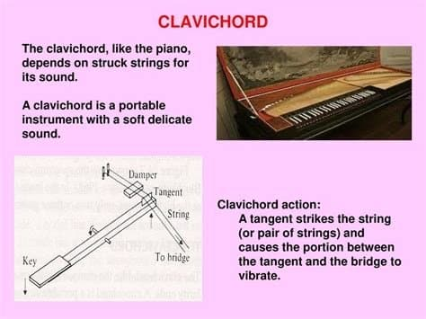

---

title: "1.2. 클라비코드의 구조와 베붕(Bebung) 기법"

category: "바로크·고전"

order: 3

source_url: "https://m.dcinside.com/board/digitalpiano/1935"

source_post_no: 1935

images_expected: 2

images_downloaded: 2

status: "complete"

---

<!-- NOTION_SYNCED_TOP: 3b726dfb-cd79-808f-8ad4-d57f791ebb17 -->

메트로폴리탄 박물관 소장 클라비코드 사진

하프시코드가 웅장한 연주회장과 귀족의 살롱을 위한 악기였다면, 클라비코드는 지극히 개인적이고 내밀한 공간을 위한 악기였음.

15세기부터 그 원형이 존재했을 정도로 역사가 깊은 이 악기는, 구조적으로 단순하지만 연주자의 감정을 섬세하게 표현할 수 있는 독특한 잠재력을 지니고 있었음.

클라비코드의 발음 원리는 건반 끝에 달린 '탄젠트(tangent)'라는 작은 놋쇠 날이 현을 '때리는' 방식임. 건반을 누르면 탄젠트가 수직으로 솟아올라 현의 특정 지점을 때리는데, 이때 탄젠트는 두 가지 핵심적인 역할을 동시에 수행함. 첫째는 현을 진동시켜 소리를 내는 망치의 역할이며, 둘째는 현의 한쪽 끝을 지지하여 진동 길이를 결정하는 브릿지(nut)의 역할임. 연주자가 건반에서 손을 뗄 때까지 탄젠트는 현에 계속 맞닿아 있으며, 이 직접적인 연결이 클라비코드의 모든 표현력을 좌우함.

이 구조의 가장 큰 장점은 연주자가 건반을 누르는 압력을 통해 음량을 직접 제어할 수 있다는 것임. 비록 악기 전체의 소리가 매우 작아 속삭이는 수준에 불과했지만, 피아니시모(pp)에서 메조포르테(mf)에 이르는 미세한 다이내믹 변화가 가능했음. 이는 하프시코드에서는 불가능한, 혁신적인 표현 방식이었음.

클라비코드의 가장 독특하고 매력적인 기법은 바로 '베붕(Bebung)'이라 불리는 비브라토 효과임. 건반을 누른 상태에서 손가락의 압력을 부드럽게 변화시키면, 현에 맞닿아 있는 탄젠트가 현의 장력을 미세하게 바꾸면서 음정이 부드럽게 떨리는 효과를 냄. 마치 바이올린 연주자가 손가락을 떨거나 가수가 목소리를 떠는 것과 유사한 이 기법은, 건반 악기로는 유일하게 클라비코드만이 구현할 수 있는 고유한 표현이었음. 이를 통해 연주자는 단순한 음의 나열을 넘어, 탄식하거나 애원하는 듯한 감정의 결을 음악에 담을 수 있었음.

이러한 특성 때문에 클라비코드는 공개 연주회보다는 개인적인 연습, 즉흥 연주, 그리고 작곡을 위한 악기로서 큰 사랑을 받았음. 특히 18세기 중반 독일의 '다감양식(Empfindsamer Stil)' 작곡가들, 그중에서도 C.P.E. 바흐는 클라비코드의 표현력을 극찬하며 이 악기를 위한 수많은 걸작을 남김. 그는 클라비코드가 "혼자 앉아 자신의 영혼과 대화하는 악기"라고 평하기도 했음.

[https://www.youtube.com/watch?v=azvcK-zNvL4](https://www.youtube.com/watch?v=azvcK-zNvL4)

연주: 미클로시 슈파니 (Miklós Spányi)

카를 필리프 에마누엘 바흐

- 자유로운 환상곡 F샵마이너

(클라비코드의 섬세한 다이내믹과 베붕 기법을 느낄수 있는 대표적인 곡)

- dc official App

<!-- NOTION_SYNCED_BOTTOM: 2f126dfb-cd79-80c9-b783-d7e85011a79e -->

