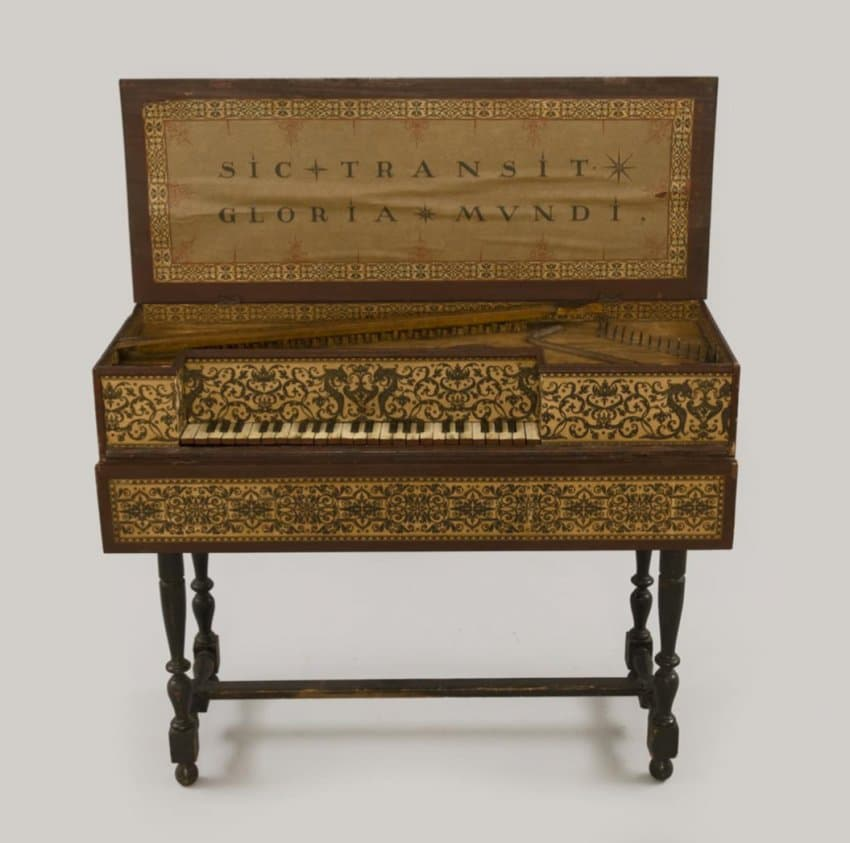
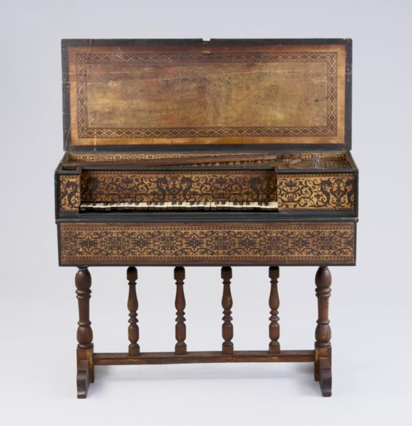

---

title: "1.3. 17-18세기 주요 건반 악기 제작과 분포"

category: "바로크·고전"

order: 4

source_url: "https://m.dcinside.com/board/digitalpiano/1966"

source_post_no: 1966

images_expected: 6

images_downloaded: 6

status: "complete"

---

<!-- NOTION_SYNCED_TOP: 3b726dfb-cd79-808f-8ad4-d57f791ebb17 -->

17세기와 18세기 유럽의 건반 악기 제작은 표준화된 공장 생산이 아닌, 고도로 숙련된 장인들의 수공업에 의존했음. 악기 제작은 각 지역의 음악적 취향, 사용 가능한 재료, 그리고 길드를 통해 전수된 기술적 전통에 따라 뚜렷한 '학파' 또는 '양식'을 형성하며 발전함. 당시 제작된 악기들은 단순한 연주 도구를 넘어, 정교한 가구이자 높은 가치를 지닌 예술품으로 취급되었음.

버지널(Virginale), 안드레아스 루커스(Andreas Ruckers) 제작

버지널(Virginale), 안드레아스 루커스(Andreas Ruckers) 제작

플랑드르 (Flanders)

벨기에의 안트베르펜을 중심으로 한 플랑드르 지역은 17세기 하프시코드 제작의 중심지였음. 특히 루커스(Ruckers)와 쿠셰(Couchet) 가문이 제작한 악기들은 유럽 전역에서 최고의 명품으로 인정받음. 플랑드르 하프시코드는 구조적으로 매우 견고하고, 풍부하며 깊이 있는 음색을 특징으로 함. 이 악기들은 성능이 매우 뛰어나 유럽 각지로 수출되었으며, 18세기 프랑스에서는 이 오래된 루커스 악기를 당시 취향에 맞게 확장하고 개조하는 '라발망(ravalement)' 작업이 유행하기도 했음.

Pascal-Joseph Taskin

Bizzi Italian Harpsichord 'Giusti 1679'

이탈리아 (Italy)

이탈리아의 하프시코드는 플랑드르 악기와는 다른 특성을 보임. 보통 단일 건반(single manual)에 케이스의 두께가 얇아 가볍게 제작되었으며, 소리는 상대적으로 짧고 타악기적인 명료함을 가졌음. 이러한 특성은 여러 악기가 함께 연주하는 합주에서 화음의 골격을 명확하게 짚어주는 지속저음(continuo) 역할에 매우 효과적이었음. 또한 제작 비용이 상대적으로 저렴하여 널리 보급될 수 있었음.

NEUPERT HARPSICHORD BLANCHET

프랑스 (France)

18세기 프랑스, 특히 파리는 하프시코드 제작의 새로운 중심지로 떠오름. 블랑셰(Blanchet), 타스캥(Taskin)과 같은 명인들은 플랑드르의 견고한 구조를 바탕으로 프랑스 특유의 우아함과 세련미를 더함. 프랑스식 하프시코드는 두 개의 건반을 가진 경우가 많았고, 풍부한 배음과 감미롭고 긴 여음을 지녀 독주 악기로서 최고의 성능을 발휘했음. 루이 14세와 15세 시대의 화려한 궁정 문화를 배경으로 프랑수아 쿠프랭, 장 필리프 라모 같은 작곡가들의 작품을 연주하는 데 최적화된 악기였음.

Zuckermann Unfretted Clavichord II 1980 Natural Cherry

독일 (Germany)

독일 지역은 하프시코드와 함께 클라비코드 제작의 중요한 중심지였음. 특히 18세기에는 '프렛이 없는(unfretted)' 클라비코드가 발전했는데, 이는 모든 건반이 자신만의 현을 가져 어떤 화음이든 자유롭게 연주할 수 있는 모델이었음. 함부르크의 하스(Hass) 가문처럼 여러 악기의 특성을 결합하려는 시도도 있었으며, 이러한 실험 정신은 이후 피아노 개발의 중요한 토양이 됨.

이처럼 각 지역의 악기는 고유한 정체성을 가지고 각국의 음악 발전에 기여함. 이 악기들은 귀족과 교회의 후원, 그리고 활발해진 무역을 통해 유럽 전역으로 퍼져나갔으며, 당대 음악가들은 특정 지역의 악기를 선호하거나 자신의 음악에 맞는 악기를 찾아다니기도 했음.

[https://www.youtube.com/watch?v=syB9mxe8CHk](https://www.youtube.com/watch?v=syB9mxe8CHk)

스위스 뇌샤텔에 있는 루커스-구종(Ruckers-Goujon) 하프시코드를 기반으로 요하네스 클링크하머(Johannes Klinkhamer)가 제작한 프랑스식 2단 건반 하프시코드 

쿠프랭의 ‘수수께끼의 바리케이드’의 신비

연주: Hanneke van Proosdij

- dc official App

<!-- NOTION_SYNCED_BOTTOM: 2f126dfb-cd79-80c9-b783-d7e85011a79e -->

