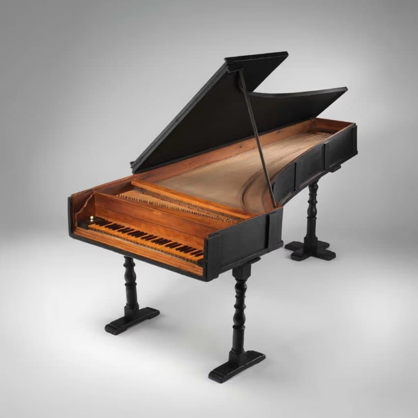
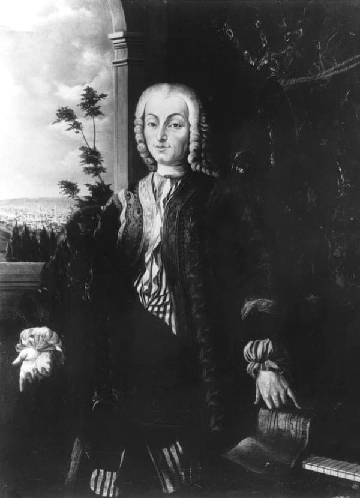

---

title: "2.1. 바르톨로메오 크리스토포리와 피아노포르테의 발명"

category: "바로크·고전"

order: 6

source_url: "https://m.dcinside.com/board/digitalpiano/1979"

source_post_no: 1979

images_expected: 3

images_downloaded: 3

status: "complete"

---

<!-- NOTION_SYNCED_TOP: 3b726dfb-cd79-808f-8ad4-d57f791ebb17 -->

현존하는 가장 오래된 피아노로 바르톨로메오 크리스토포리의 공방에서 제작되어 지금까지 전해지는 세 대의 피아노 중 한 대(뉴욕 메트로 폴리탄 박물관)

1700년경. 피아노의 역사는 이탈리아 피렌체의 악기 장인, 바르톨로메오 크리스토포리(Bartolomeo Cristofori, 1655-1731)로부터 시작됨. 그는 메디치 가문의 수석 악기 관리자이자 당대 최고의 하프시코드 제작자 중 한 사람이었음. 

기존 악기의 장단점을 누구보다 잘 알았던 그는, 현을 뜯는 방식으로는 터치에 따른 강약 조절이 불가능하다는 근본적인 한계를 극복하고자 했음.

그의 목표는 '부드럽고 강한 소리를 낼 수 있는 하프시코드', 즉 '그라비쳄발로 콜 피아노 에 포르테(gravicembalo col piano e forte)'를 만드는 것이었음. 수많은 연구와 실험 끝에, 그는 1700년경 마침내 혁신적인 메커니즘을 완성함. 

이 메커니즘의 핵심은 나무 망치(hammer)가 현을 때린 직후, 건반을 계속 누르고 있더라도 망치가 즉시 현에서 떨어져 자유로운 진동을 방해하지 않게 하는 '이탈 장치(escapement)'에 있었음.

크리스토포리의 액션은 다음과 같이 작동함. 건반을 누르면 중간 레버를 통해 망치가 위로 솟구쳐 현을 때림. 망치가 현에 닿기 직전, 이스케이프먼트 장치가 작동하여 망치를 밀어 올리던 부품과의 연결을 끊음. 이로써 망치는 자신의 운동량만으로 현을 때린 후 즉시 아래로 떨어지게 됨. 

떨어진 망치는 '백 체크(back check)'라는 부품에 의해 잡혀, 의도치 않게 다시 튀어 올라 현을 건드리는 것을 방지함. 이 모든 과정이 연주자가 건반을 누르는 속도와 힘에 비례하여 망치의 속도를 결정했고, 이는 곧 소리의 크기로 직결되었음.

이 발명품은 하프시코드의 외형을 하고 있었으나, 완전히 새로운 영혼을 가진 악기였음. 비록 초기 피아노포르테의 소리는 하프시코드만큼 밝거나 크지는 않았지만, 역사상 최초로 연주자의 손끝에서 셈여림이 조절되는 건반 악기라는 점에서 혁명적이었음. 

크리스토포리는 평생에 걸쳐 약 20여 대의 피아노포르테를 제작한 것으로 알려져 있으며, 현재까지 원형을 보존한 그의 피아노가 세 대 남아있음.

[https://www.youtube.com/watch?v=JhPElISPr9s](https://www.youtube.com/watch?v=JhPElISPr9s)

로도비코 주스티니 - 소나타 1번 (최초로 '피아노포르테'를 위해 출판된 곡집 수록곡)

- dc official App

<!-- NOTION_SYNCED_BOTTOM: 2f126dfb-cd79-80c9-b783-d7e85011a79e -->

