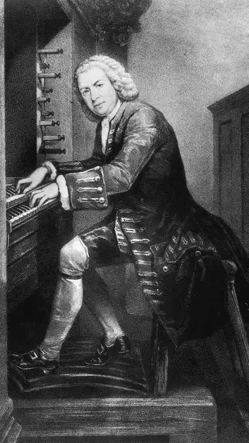
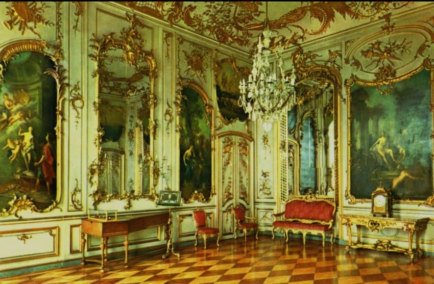

---

title: "2.3. 고트프리트 질버만의 개량과 독일 지역으로의 확산"

category: "바로크·고전"

order: 8

source_url: "https://m.dcinside.com/board/digitalpiano/2007"

source_post_no: 2007

images_expected: 2

images_downloaded: 2

status: "complete"

---

<!-- NOTION_SYNCED_TOP: 3b726dfb-cd79-808f-8ad4-d57f791ebb17 -->

크리스토포리의 피아노포르테 발명은 한동안 이탈리아 밖으로 널리 알려지지 않았음. 이 혁신적인 아이디어가 유럽 전역으로 퍼져나가는 데 결정적인 역할을 한 것은 1711년, 이탈리아의 작가 시피오네 마페이(Scipione Maffei)가 쓴 상세한 소개 기사였음. 이 기사에는 크리스토포리 액션의 다이어그램까지 포함되어 있었고, 1725년에 독일어로 번역되면서 독일 악기 제작자들의 주목을 받게 됨.

[https://www.denzilwraight.com/Maffei.pdf?utm\_source=perplexity](https://www.denzilwraight.com/Maffei.pdf?utm_source=perplexity)

<피아노 히스토리 센터(Piano History Center)라는 웹사이트에 게시된, 시피오네 마페이의 1711년 기사를 심층적으로 분석한 해설 자료>

이 기술에 가장 큰 관심을 보인 인물은 독일 최고의 오르간 제작자였던 고트프리트 질버만(Gottfried Silbermann, 1683-1753)이었음. 그는 마페이의 기사를 바탕으로 1730년대부터 피아노포르테를 제작하기 시작했는데, 그의 초기 모델은 사실상 크리스토포리의 설계를 그대로 복제한 것이었음.

질버만의 피아노 역사에서 가장 중요한 일화는 요한 세바스티안 바흐와의 만남임. 1736년경, 질버만은 자신감을 갖고 자신의 새 악기를 바흐에게 선보였음. 하지만 바흐는 악기의 기본적인 아이디어는 칭찬하면서도, 두 가지를 날카롭게 비판함. 첫째는 건반의 터치가 너무 무겁고 둔하다는 점, 둘째는 고음역대의 소리가 너무 약하다는 점이었음. 당대 최고의 건반 연주자이자 대가였던 바흐의 비판은 질버만에게 큰 과제를 안겨줌.

질버만은 이에 좌절하지 않고 수년간 악기 개량에 몰두함. 그는 바흐의 조언을 받아들여 액션을 더 가볍고 반응성 있게 만들고, 악기 전체의 음향적 균형을 맞추는 데 성공함. 

그리고 1747년, 프로이센의 프리드리히 대왕의 초청으로 포츠담의 상수시 궁전을 방문한 바흐는 그곳에서 질버만의 '개량된' 피아노포르테 여러 대를 다시 접하게 됨. 악기를 연주해 본 바흐는 크게 만족하며 훌륭하다고 칭찬했고, 왕이 내어준 주제를 바탕으로 즉흥 연주를 선보였는데, 이것이 바로 '음악의 헌정(Musikalisches Opfer)'의 탄생 배경임.

<프리드리히 대왕이 소유했던 1746년 제조된 질버만(Silbermann) 포르테피아노는 현재 상수시 궁전의 음악당(실내) 안에 보존되어 있음.>

이 사건은 질버만 피아노의 명성을 확립하는 결정적인 계기가 되었음. 바흐의 인정은 최고의 품질 보증서나 다름없었기 때문임. 이후 질버만의 피아노는 독일 전역에서 높은 평가를 받게 됨. 더 중요한 것은, 질버만 가문의 공방에서 훈련받은 제작자들이 독일 각지에 자신들의 공방을 세우면서 피아노 제작 기술을 퍼뜨렸다는 사실임. 

이들 중에는 훗날 모차르트가 사랑한 피아노를 만들게 될 요한 안드레아스 슈타인(Johann Andreas Stein)도 있었음.

결과적으로 크리스토포리에 의해 이탈리아에서 시작된 피아노의 혁신은, 질버만과 바흐의 만남을 통해 독일에서 그 잠재력을 꽃피우고 다음 시대로 나아갈 동력을 얻게 된 것임.

[https://www.youtube.com/watch?v=OX4\_CwLcl4M](https://www.youtube.com/watch?v=OX4_CwLcl4M)

J.S. 바흐 - 음악의 헌정 중 리체르카레 a 3 

(Ricercar a 3, BWV 1079. 바흐가 질버만의 피아노로 즉흥연주한 것을 바탕으로 작곡됨)

피아노 : 임윤찬

<!-- NOTION_SYNCED_BOTTOM: 2f126dfb-cd79-80c9-b783-d7e85011a79e -->

