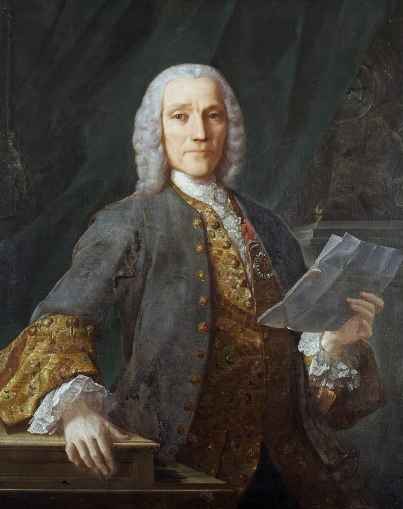
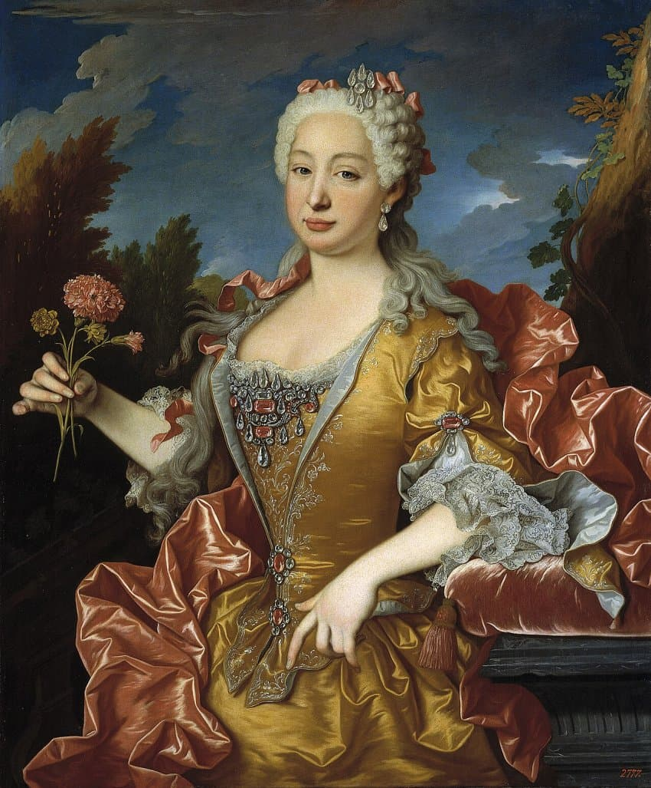

---

title: "3.1. 도메니코 스카를라티의 소나타와 이베리아 반도의 영향"

category: "바로크·고전"

order: 10

source_url: "https://m.dcinside.com/board/digitalpiano/2017"

source_post_no: 2017

images_expected: 2

images_downloaded: 2

status: "complete"

---

<!-- NOTION_SYNCED_TOP: 3b726dfb-cd79-808f-8ad4-d57f791ebb17 -->

도메니코 스카를라티(Domenico Scarlatti, 1685-1757)

도메니코 스카를라티는 바흐, 헨델과 같은 해에 태어났으나, 그들과는 전혀 다른 음악 세계를 구축한 독창적인 작곡가임. 유명 오페라 작곡가인 알레산드로 스카를라티의 아들로 태어나 초기에는 아버지의 영향을 받았으나, 그의 진정한 천재성은 555곡에 달하는 방대한 양의 건반 소나타에서 발현되었음.

스카를라티의 후원자, 마리아 바르바라 왕비

그의 음악 인생에 결정적인 전환점은 이베리아 반도로의 이주였음. 그는 1719년부터 포르투갈의 공주 마리아 바르바라를 섬기기 시작했고, 1729년 그녀가 스페인 왕세자비(아스투리아스 공비)가 되자 마드리드로 함께 이주하여 여생을 그곳에서 보냄. 

유럽 음악의 중심지에서 벗어나 스페인에 정착한 이 경험은 그의 음악에 깊고 독특한 색채를 부여함.

스카를라티의 소나타는 대부분 단일 악장으로, 두 부분으로 나뉘는 단순한 이진 형식(binary form)을 따름. 하지만 그 안의 내용은 대담하고 예측 불가능한 아이디어로 가득 차 있음. 특히 스페인 민속 음악과 기타 연주법의 영향이 두드러지게 나타남.

첫째, 기타의 거친 스트러밍(strumming)을 연상시키는 격렬한 아르페지오와 불협화음적인 음 덩어리(acciaccatura)를 과감하게 사용했음. 

둘째, 스페인 민속춤의 리듬, 예컨대 판당고(fandango)나 호타(jota)에서 비롯된 강렬하고 복잡한 당김음 리듬이 곡 전체에 생동감을 불어넣음. 

셋째, 양손을 넓게 도약시키거나 빠르게 교차하는 기법, 한 손으로 매우 빠른 음표를 반복적으로 연주하는 기법 등 당시로서는 상상하기 어려운 수준의 기교를 요구했음. 이는 건반 위에서 스페인 기타의 현란한 주법이나 캐스터네츠의 타악기적인 효과를 재현하려는 시도였음.

결과적으로 스카를라티는 바로크의 형식적 틀 안에서 스페인의 민속적 에너지와 자신만의 기교적 상상력을 결합하여, 고전주의 소나타를 예견하는 듯한 혁신적이고 개성 넘치는 사운드를 창조해 냄. 그의 음악은 동시대 다른 작곡가들의 작품과는 구별되는 독보적인 위치를 차지하고 있음.

[https://www.youtube.com/watch?v=fhqiy7KNGHU](https://www.youtube.com/watch?v=fhqiy7KNGHU)

도메니코 스카를라티 

- 소나타 D단조 [K.141](http://K.141) 

-기타 연주를 연상시키는 빠른 연타와 격렬한 리듬이 특징적인 곡

- dc official App

<!-- NOTION_SYNCED_BOTTOM: 2f126dfb-cd79-80c9-b783-d7e85011a79e -->

