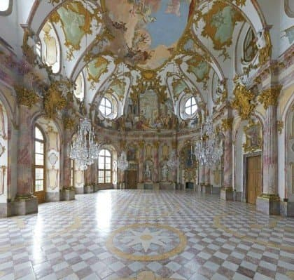

---

title: "4. 독일 후기 바로크 건반 음악의 정점"

category: "바로크·고전"

order: 13

source_url: "https://m.dcinside.com/board/digitalpiano/2057"

source_post_no: 2057

images_expected: 1

images_downloaded: 1

status: "complete"

---

<!-- NOTION_SYNCED_TOP: 3b726dfb-cd79-808f-8ad4-d57f791ebb17 -->

독일 바로크 시대를 대표하는 뷔르츠부르크 레지던스, 황제의 홀

18세기 전반, 이탈리아의 기교적인 화려함, 프랑스의 우아한 세련미, 그리고 새로운 감각의 갈랑 양식이 유럽을 물들이고 있을 때, 독일을 중심으로 이 모든 음악적 유산을 흡수하여 하나의 거대한 용광로처럼 녹여낸 위대한 음악이 탄생하고 있었음.

독일 후기 바로크 음악은 이전 시대와 다른 국가들의 양식을 종합하고, 여기에 대위법적 기법과 고도의 구조적 완성도를 더하여 서양 음악사의 가장 장대한 봉우리 중 하나를 쌓아 올렸는데

이 시대와 양식을 대표하는 두 거장은 요한 세바스티안 바흐와 게오르크 프리드리히 헨델임.

특히 건반 음악 분야에서 바흐의 업적은 전무후무한 경지이며, 건반 악기를 통해 음악의 모든 기법과 형식을 탐구하고, 교육과 연주, 그리고 지적인 유희를 위한 방대한 작품들을 남겼음.

4장에서는 먼저 음악의 아버지라 불리는 바흐의 건반 음악 세계를 전체적으로 조망하고, 그의 교육용 작품들과 춤곡 모음곡들을 구체적으로 살펴볼 예정임.

또한, 바흐와는 다른 삶의 경로를 걸으며 더 대중적이고 명쾌한 스타일의 건반 음악을 선보였던 헨델의 작품 세계를 포괄해 독일 바로크 음악의 위대한 정점을 확인하고자 함.

- dc official App

<!-- NOTION_SYNCED_BOTTOM: 2f126dfb-cd79-80c9-b783-d7e85011a79e -->

