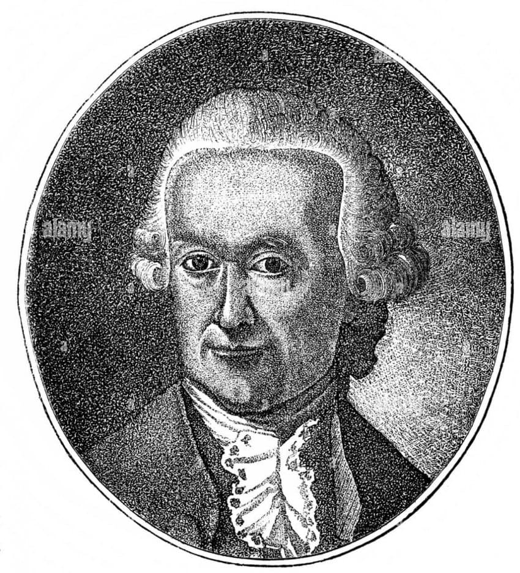
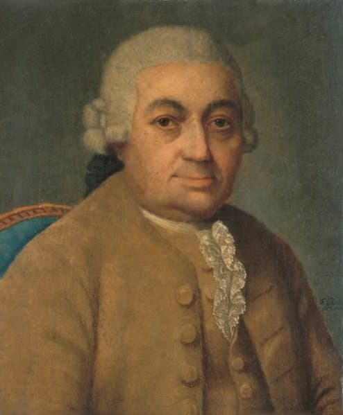

---

title: "4.2. 인벤션과 신포니아, 평균율 클라비어 곡집"

category: "바로크·고전"

order: 15

source_url: "https://m.dcinside.com/board/digitalpiano/2068"

source_post_no: 2068

images_expected: 4

images_downloaded: 4

status: "complete"

---

<!-- NOTION_SYNCED_TOP: 3b726dfb-cd79-808f-8ad4-d57f791ebb17 -->

요한 세바스티안 바흐는 위대한 작곡가이자 연주가였을 뿐만 아니라, 헌신적이고 체계적인 교육자였음. 그의 교육자적 면모가 가장 잘 드러나는 분야가 바로 건반 음악임. 그는 장남 빌헬름 프리데만을 비롯한 아들들과 수많은 제자들을 위해, 단순한 기교 훈련을 넘어 음악적 사고력과 작곡 능력까지 길러주는 것을 목표로 하는 다수의 교육용 작품을 남김.

<빌헬름 프리데만 바흐: 바흐의 장남.>

인벤션과 신포니아 (BWV 772-801)

1723년에 완성된 이 곡집의 원제는 '올바른 지침(Auffrichtige Anleitung)'으로, 바흐 자신이 서문에 그 목적을 명확히 함.

첫째, 2성부(인벤션)와 3성부(신포니아)를 깨끗하게 연주하는 법을 배우고, 

둘째, '노래하듯이(cantabile)' 연주하는 스타일을 익히며, 

셋째, 작곡에 대한 강한 기초를 얻게 하는 것이었음.

각 곡은 하나의 짧고 독창적인 음악적 아이디어(Inventio)를 제시하고, 그것을 대위법적으로 모방하고 발전시켜 전체 곡을 완성하는 방식으로 이루어짐. 

이는 제자들이 단지 손가락만 훈련하는 것이 아니라, 음악이 어떻게 논리적으로 구성되는지를 자연스럽게 체득하게 하려는 바흐의 깊은 의도가 담겨있음. 인벤션은 2성부 대위법의 정수를, 신포니아는 3성부 푸가의 입문서 역할을 하는, 고도로 응축된 주옥같은 작품임.

<칼 필리프 에마누엘 바흐: 바흐의 둘째 아들로, 고전주의로 넘어가는 다리 역할을 함.>

평균율 클라비어 곡집

(Das Wohltemperierte Klavier, BWV 846-893)

음악의 구약성서'라 불리는 이 기념비적인 작품집은 바흐의 교육적 이상이 집대성된 결과물임. 평균율(Well-Tempered)'이란 당시 새롭게 대두되던 조율법으로, 12개의 모든 반음을 비교적 균등하게 조율하여 24개의 모든 장조와 단조로 큰 무리 없이 연주할 수 있게 하는 시스템을 의미함. 바흐는 이 곡집을 통해 새로운 조율 시스템의 음악적 가능성을 증명해 보였음.

1권(1722)과 2권(약 1742)으로 구성된 각 권은 24개의 모든 조(C장조, c단조, C샵장조, c샵단조...) 순서에 따라 '프렐류드(Prelude)'와 '푸가(Fuga)' 한 쌍으로 이루어진 24개의 세트를 담고 있음. 프렐류드는 아르페지오 연습곡, 자유로운 환상곡, 춤곡, 아리아 등 매우 다채로운 양식으로 푸가를 위한 서주 역할을 함. 뒤따르는 푸가는 2성부에서 5성부에 이르기까지, 바흐가 구사할 수 있는 모든 대위법적 기법의 정수를 보여줌.

이 작품들은 지난 300년간 모든 피아니스트와 작곡가 지망생들에게 필수적인 교재이자 끝없는 영감의 원천으로 기능하며, 바흐의 교육적 유산이 얼마나 위대한지를 증명하고 있음.

[**Music  Musikabteilung  Staatsbibliothek zu Berlin**](https://staatsbibliothek-berlin.de/en/about-the-library/departments/music)

[Music  Musikabteilung  Staatsbibliothek zu Berlin](https://staatsbibliothek-berlin.de/en/about-the-library/departments/music)

[staatsbibliothek-berlin.de](https://staatsbibliothek-berlin.de/en/about-the-library/departments/music)

베를린 주립도서관 : 요한 세바스티안 바흐의 모든 친필 악보 중 약 80%를 소장하고 있음.

[**Bach digital - Start**](https://www.bach-digital.de/content/index.xed)

[Bach digital - Start](https://www.bach-digital.de/content/index.xed)

[www.bach-digital.de](https://www.bach-digital.de/content/index.xed)

Bach Digital : 바흐 관련 사료 및 악보의 온라인 최대·최고 권위의 디지털 도서관

[https://www.youtube.com/watch?v=xCqWH9bKzQE](https://www.youtube.com/watch?v=xCqWH9bKzQE)

평균율 클라비어 곡집 1권 1번 C장조, 프렐류드, 푸가

- dc official App

<!-- NOTION_SYNCED_BOTTOM: 2f126dfb-cd79-80c9-b783-d7e85011a79e -->

