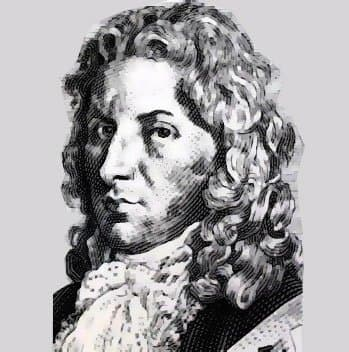
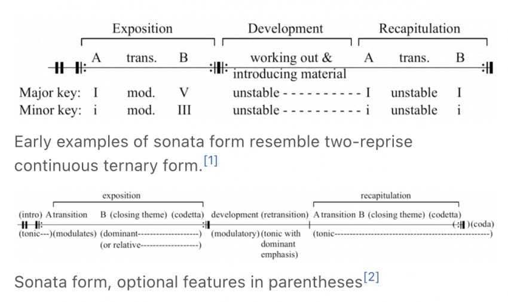

---

title: "5.3. 소나타 형식의 기원과 초기 발전 과정"

category: "바로크·고전"

order: 21

source_url: "https://m.dcinside.com/board/digitalpiano/2177"

source_post_no: 2177

images_expected: 4

images_downloaded: 4

status: "complete"

---

<!-- NOTION_SYNCED_TOP: 3b726dfb-cd79-808f-8ad4-d57f791ebb17 -->

요한 슈타미츠(Johann Stamitz)

고전주의 시대를 대표하는 가장 중요하고 독창적인 음악 형식은 바로 ‘소나타 형식(Sonata Form)’임. 이는 소나타, 교향곡, 협주곡, 실내악 등 당시 대부분의 기악 장르에서 주로 첫 악장을 구성하는 핵심적인 틀이었음. 소나타 형식은 단순히 악장들을 나열하는 것을 넘어, 제시된 음악적 아이디어들 간의 극적인 대립과 갈등, 그리고 최종적인 해결 과정을 논리적으로 담아내는 하나의 드라마와 같았음.

이 정교한 형식은 어느 날 갑자기 발명된 것이 아니라, 바로크 시대의 ‘이진 형식(Binary Form)’으로부터 점진적으로 발전한 결과물임. 바로크 춤곡이나 스카를라티의 소나타에서 흔히 볼 수 있는 이진 형식은 악곡을 A와 B, 두 부분으로 나누는 구조였음.

A 부분: 으뜸조(Tonic)에서 시작하여 딸림조(Dominant)로 조성을 바꾸며 끝남. ( |: I → V :| )

B 부분: 딸림조에서 시작하여 여러 다른 조를 탐색하다가, 마지막에 다시 으뜸조로 돌아와 끝남. ( |: V → ... → I :| )

여기서 중요한 진화의 단서는 순환 이진 형식(Rounded Binary Form)’에서 나타남.

B 부분이 끝날 무렵, A 부분의 시작 주제가 으뜸조로 다시 한번 나타나 안정감을 주며 마무리하는 형태를 말함. 

바로 이 (시작 주제의 귀환)이라는 아이디어가 확장되고 체계화되면서 전고전주의 시대를 거치며, 이 두 부분짜리 구조는 점차 세 부분으로 발전해 고전주의 소나타 형식이 탄생함.

[**Sonata form - Wikipedia**](https://en.wikipedia.org/wiki/Sonata_form)

[Sonata form - Wikipedia](https://en.wikipedia.org/wiki/Sonata_form)

[en.wikipedia.org](https://en.wikipedia.org/wiki/Sonata_form)

1. 제시부 (Exposition): 두 개의 대조적인 주제와 조성을 제시하여 음악적 갈등의 씨앗을 뿌리는 부분. 으뜸조(I)의 제1주제와 새로운 조(주로 딸림조 V)의 제2주제가 나타나 대립함.

2. 발전부 (Development): 제시부의 주제들을 자유롭게 분해하고 재조합하며 여러 조성을 탐험하는, 가장 불안정하고 극적인 부분.

3. 재현부 (Recapitulation): 발전부에서 고조된 갈등을 해결하는 부분. 제시부의 모든 주제가 다시 나타나지만, 가장 중요한 규칙으로 제2주제가 으뜸조(I)로 재현되어 조성적 갈등을 해소하고 곡 전체에 통일성과 안정감을 부여함.

만하임 궁전의 안뜰

이러한 발전에 결정적인 역할을 한 인물 중 한 명이 바로 요한 슈타미츠(Johann Stamitz)임. 그는 직접적인 피아노 계파(연주자·교육자 계통)는 아니지만, 소나타 형식의 정립과 발전에 실질적으로 매우 중요한 영향을 미쳤음.

슈타미츠는 당대 유럽 최고의 오케스트라였던 만하임 악파의 중심인물로, 교향곡의 첫 악장에서 소나타 형식을 적극적으로 도입하여 그 틀을 발전시킴.

그의 작품에서는 하나의 악장 안에 성격이 다른 주제를 대비시키는 원리가 두드러지며, 이는 하이든과 모차르트가 완성하는 후기 고전 소나타 형식의 중요한 기반이 됨.

 특히 만하임 오케스트라가 자랑하던 ‘만하임 크레셴도’와 같은 극적인 다이내믹의 표현은, 소나타 형식의 발전부(Development)가 가진 극적 효과와 전개법에 중요한 영향을 주었음.

이처럼 슈타미츠와 같은 전고전주의 대가들의 수많은 실험을 거쳐, 소나타 형식은 1770년대에 이르러 세 부분의 드라마적 구조로 정립됨.

[https://www.youtube.com/watch?v=4xeAsc6m35w](https://www.youtube.com/watch?v=4xeAsc6m35w)

Mozart piano sonata [no.16](http://no.16) 1st

피아노 : 랑랑

- dc official App

<!-- NOTION_SYNCED_BOTTOM: 2f126dfb-cd79-80c9-b783-d7e85011a79e -->

