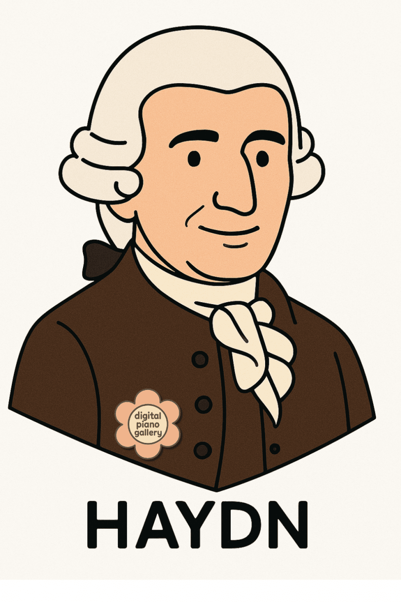

---

title: "6. 프란츠 요제프 하이든, 소나타 형식의 개척자"

category: "바로크·고전"

order: 22

source_url: "https://m.dcinside.com/board/digitalpiano/2204"

source_post_no: 2204

images_expected: 1

images_downloaded: 1

status: "complete"

---

<!-- NOTION_SYNCED_TOP: 3b726dfb-cd79-808f-8ad4-d57f791ebb17 -->

하이든은 '교향곡의 아버지', '현악 4중주의 아버지'라 불리는 동시에, 건반 소나타 장르를 확립하고 소나타 형식을 완성하는 데 결정적인 역할을 한 고전주의 시대의 첫 번째 거장임.

그는 오랜 생애 동안 안정적인 후원자였던 헝가리의 에스테르하지(Esterházy) 가문을 섬기며, 끊임없는 실험과 창작을 통해 바로크에서 고전주의로 넘어가는 음악사의 격변기를 이끌었고, 

그의 음악은 명료한 형식미, 재치 있는 유머, 그리고 민속적인 활기로 가득 차 있으며, 이는 그의 건반 작품에도 고스란히 반영되어 있음.

이 장에서는 하이든이 어떻게 초기 건반 소나타에서부터 점차 자신만의 독창적인 스타일을 구축해 나갔는지와 함께 대표적인 소나타들을 살펴보며 그의 업적을 구체적으로 살펴봄

마지막으로 그의 건반 변주곡과 협주곡을 통해 소나타 외의 장르에서 그가 이룬 성취와 '파파 하이든'의 따뜻하고 견고한 음악 세계를 이야기하고자함.

Papa Haydn은 에스테르하자 악단 음악가들이 하이든을 부른 애칭이었고, 모차르트도 이 호칭을 사용함

- dc official App

<!-- NOTION_SYNCED_BOTTOM: 2f126dfb-cd79-80c9-b783-d7e85011a79e -->

