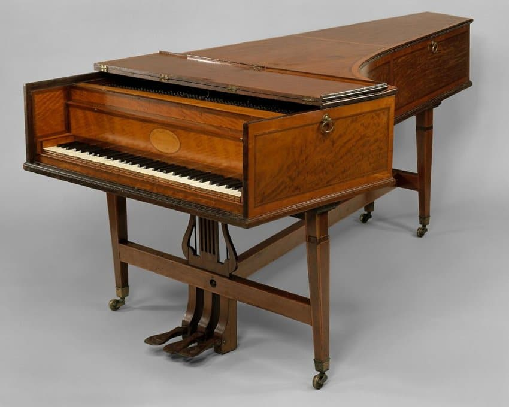

---

title: "6.3. 하이든의 대표적인 소나타. C단조와 E♭장조"

category: "바로크·고전"

order: 25

source_url: "https://m.dcinside.com/board/digitalpiano/2260"

source_post_no: 2260

images_expected: 2

images_downloaded: 2

status: "complete"

---

<!-- NOTION_SYNCED_TOP: 3b726dfb-cd79-808f-8ad4-d57f791ebb17 -->

<독일의 문학 운동인 ‘슈투름 운트 드랑’(질풍노도)시기의 대표적 작품. 요한 하인리히 퓌슬리의 그림 '악몽' >

하이든의 키보드 소나타 중에서 Grout & Palisca 『서양음악사』에서 대표적 사례로 모두 언급한 두 곡을 통해 양식적 특징과 그의 음악 세계를 더 깊이 알 수 있음. 

'질풍노도' 시기의 정점인 C단조 소나타와, 그의 창작 인생을 총결산하는 E♭장조 소나타임.

소나타 C단조, [Hob.XVI:20](http://Hob.XVI:20)

1771년에 작곡된 이 소나타는 하이든의 중기 스타일을 대표하는 작품으로, 이전의 갈랑 양식과는 완전히 결별하고 어둡고 격렬한 감정의 세계를 표현함.

1악장 (Moderato): 비극적인 분위기의 주제로 시작하여, 짧은 동기들이 서로 격렬하게 부딪히고 갑작스러운 휴지가 긴장감을 고조함. 마치 오페라의 비장한 독백(recitative)을 듣는 듯한 자유롭고 극적인 프레이즈들이 특징적임.

2악장 (Andante con moto): 차분하고 명상적인 분위기 속에 미묘한 불안감과 애수가 서려 있음. 섬세한 다이내믹의 변화와 꾸밈음 사용이 돋보임.

3악장 (Finale: Allegro): 격렬하고 폭풍처럼 몰아치는 악장으로, 단조의 비극적인 성격을 끝까지 밀어붙임. 쉼 없이 질주하는 리듬과 강렬한 악센트는 '질풍노도'라는 이름에 걸맞은 강렬한 느낌을 줌.

<18세기 후반 존 브로드우드 사의 그랜드 피아노. 하이든의 후기 소나타에 영감을 준, 더 크고 큰 사운드의 영국식 피아노>

소나타 E♭장조, [Hob.XVI:52](http://Hob.XVI:52)

1794년 런던에서 작곡된 이 곡은 하이든이 남긴 마지막 소나타이자 그의 모든 키보드 작품 중 가장 규모가 크고 장대한 작품임.

1악장 (Allegro): 마치 교향곡의 도입부처럼 당당하고 힘찬 화음으로 시작함. 런던의 피아노가 가진 풍부한 음량을 최대한 활용하여 오케스트라적인 음향을 만들어냄. 매우 기교적인 패시지와 넓은 음역을 사용하여 화려함의 극치를 보여주며, 발전부에서는 주제-동기 가공 기법의 정수를 보여줌.

2악장 (Adagio): E♭장조와 매우 먼 E장조로 조바꿈하여 신비로운 분위기를 만듦. 깊이 있는 성찰과 서정성이 담긴 아름다운 악장으로, 베토벤의 초기 소나타 느린 악장을 예견하는 듯한 무게감을 지님.

3악장 (Finale: Presto): 재치와 유머가 넘치는 하이든 특유의 피날레. 매우 빠른 속도로 질주하며, 예상치 못한 전환과 재치 있는 악상들이 끊임없이 나타나 즐거운 분위기를 연출함. 장대한 1악장과 깊이 있는 2악장을 지나, 그의 낙천적인 성격으로 돌아와 화려하게 곡을 마무리함.

이 두 작품은 하이든이 한편으로는 얼마나 깊고 진지한 감정을 탐구했는지, 다른 한편으로는 얼마나 장대하고 화려한 경지에 도달했는지를 보여줌.

[https://www.youtube.com/watch?v=SvPzGqZhcJk](https://www.youtube.com/watch?v=SvPzGqZhcJk)

하이든 키보드 소나타 소나타 E♭장조, [Hob.XVI:52](http://Hob.XVI:52)

피아노 : 예브게니 키신

- dc official App

<!-- NOTION_SYNCED_BOTTOM: 2f126dfb-cd79-80c9-b783-d7e85011a79e -->

