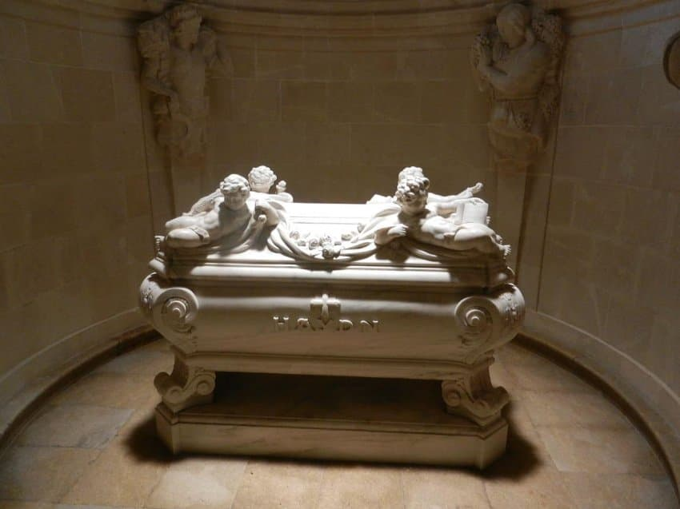
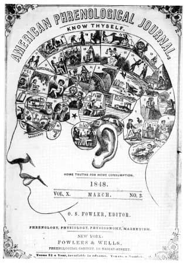

---

title: "(번외) 하이든의 두번째 장례. 145년 만에 만난 몸과 머리."

category: "바로크·고전"

order: 27

source_url: "https://m.dcinside.com/board/digitalpiano/2288"

source_post_no: 2288

images_expected: 4

images_downloaded: 4

status: "complete"

---

<!-- NOTION_SYNCED_TOP: 3b726dfb-cd79-808f-8ad4-d57f791ebb17 -->

오스트리아 아이젠슈타트의 베르크 교회에 있는 하이든의 묘지에는, 하나의 몸과 두 개의 두개골이 함께 잠들어 있음.

하이든은 1809년 5월 31일, 오스트리아 빈에서 세상을 떠났는데, 당시 나폴레옹의 프랑스 군대가 빈을 점령하고 있어 하이든의 장례는 조촐하게 치러지고, 시신은 빈 외곽의 한 공동묘지에 안장됨.

같은해 6월, 요제프 카를 로젠바움(에스테르하지 가문의 전 비서)과 요한 네포무크 페터(교도소장)가 묘지기를 매수하여 하이든의 무덤을 파헤치고 시신에서 머리를 절단해 훔쳐 감.

이유는 당시 유행하던 사이비 과학인 '골상학(Phrenology)' 때문인데, 그들은 천재 음악가인 하이든의 두개골을 연구하고 싶어 했음.

당시 유행했던 골상학은 두개골의 모양이나 혹은 특정 부위의 융기를 통해 그 사람의 재능이나 성격을 알 수 있다고 믿는 학문임.

1820년, 하이든의 오랜 후원자였던 에스테르하지 가문의 니콜라우스 2세가 하이든의 유해를 자신이 있는 아이젠슈타트의 베르크 교회에 있는 웅장한 묘로 이장하기로 결정함. 

그리고 파묘했을 때, 그제서야 시신에 머리가 없다는 사실을 발견하고 도난 사실을 알게됨.

에스테르하지 공작은 즉시 범인들을 찾아냈지만, 그들은 이미 하이든의 진짜 두개골을 깊숙이 숨긴 뒤였고. 공작에게 가짜 두개골을 주며 위기를 모면함.

이후 하이든의 진짜 두개골은 로젠바움과 페터의 손을 떠나 여러 사람의 손을 거치며 돌고 돌면서 때로는 침대 매트리스 속에 숨겨지기도 하고, 나중에는 빈 음악협회의 유리 진열장 안에 전시되어 방문객들의 구경거리가 되기도 함

<빈 음악협회에 전시 중인 하이든의 진짜 두개골>

그래서 아이젠슈타트의 하이든 묘지에는 머리가 없는 몸통과, 나중에 가짜로 판명된 다른 사람의 두개골이 함께 묻혀 있음.

이 어처구니 없는 상태는 20세기 중반까지 이어지다. 수많은 논의와 협상 끝에, 마침내 1954년, 빈 음악협회는 보관하고 있던 하이든의 진짜 두개골을 아이젠슈타트로 돌려보내는 데 동의함.

하이든이 세상을 떠난 지 145년 만인 1954년 6월 5일, 성대한 의식과 함께 그의 진짜 두개골은 마침내 자신의 몸과 재회하여 묘지에 안치됨.

1954년 6월 5일, 하이든의 진짜 두개골이 마침내 그의 유해와 다시 합쳐지는 역사적인 순간.

두개골을 들고 있는 사람은 오스트리아의 조각가이자, 두개골 반환 운동에 앞장섰던 구스트누스 암브로시임.

두번째 장례는 수많은 기자들과 관계자들이 지켜보는 가운데 매우 성대하고 공개적으로 치러졌고, 가짜인 줄 모르고 함께 묻어두었던 누군가의 두개골은 꺼내지 않고 그대로 두기로 결정함.

가짜가 확실한 두개골을 버리지 않은 이유는 워낙 다른 얘기들이 많아서 뭐가 진실인지 모르겠음.

- dc official App

<!-- NOTION_SYNCED_BOTTOM: 2f126dfb-cd79-80c9-b783-d7e85011a79e -->

