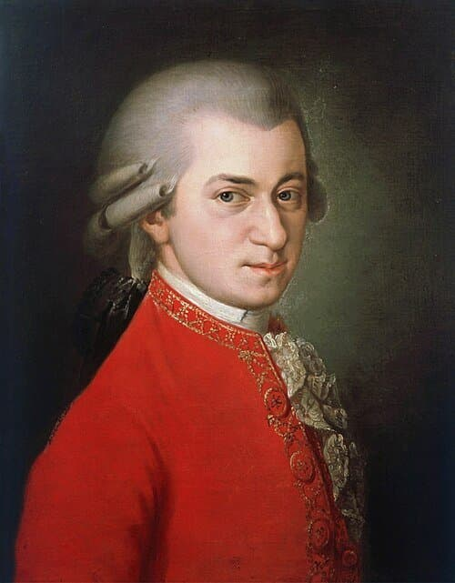
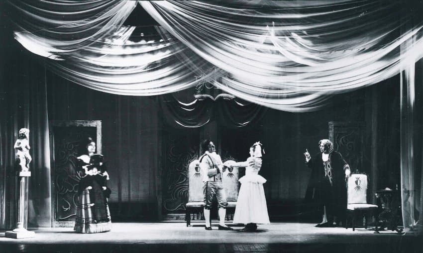

---

title: "7.1. 노래하는 선율: 칸타빌레 스타일과 오페라의 영향"

category: "바로크·고전"

order: 29

source_url: "https://m.dcinside.com/board/digitalpiano/2339"

source_post_no: 2339

images_expected: 3

images_downloaded: 3

status: "complete"

---

<!-- NOTION_SYNCED_TOP: 3b726dfb-cd79-808f-8ad4-d57f791ebb17 -->

바바라 크라프트가 1819년에 제작한 모차르트의 사후 초상화. 이 작품은 요제프 손레이트너의 의뢰로 모차르트의 누나 마리아 안나의 자료를 바탕으로 그린 것으로, 모차르트가 사망한 지 28년 후에 완성됨

모차르트 건반 음악의 본질을 이해하기 위해 그의 음악이 ‘얼마나 성악적인가’를 파악해야함.

그에게 있어 음악의 가장 이상적인 형태는 인간의 목소리였으며, 피아노를 포함한 모든 악기는 그 목소리를 모방하고 재현해야 하는 대상이었음. 

그의 피아노 작품 전반에 흐르는 유려하고 서정적인 선율, 즉 칸타빌레(cantabile, 노래하듯이) 는 그의 음악관이 직접적으로 반영된 결과물임.

이러한 뿌리는 그가 평생 몰두했던 이탈리아 오페라에 있음. 모차르트는 역사상 가장 위대한 오페라 작곡가 중 한 명이었으며, 그의 기악곡 작법은 오페라 무대에서의 경험과 밀접하게 연결되어 있음. 

오페라에서 멜로디는 단순히 아름다운 선율이 아니라, 등장인물의 성격, 심리 상태, 그리고 극적인 상황을 규정하는 가장 중요한 수단임. 

모차르트는 이러한 작법을 피아노 소나타와 피아노 협주곡에 그대로 적용함. 

그의 소나타에서 제1주제와 제2주제는 단순히 조성적으로 대립하는 것을 넘어, 마치 서로 다른 성격의 두 인물이 무대 위에서 만나 대화를 나누는 듯한 인상을 줌.

예를 들어, 느린 악장은 종종 오페라의 비극적인 여주인공이 부르는 애절한 아리아(Aria)와 같이 깊은 슬픔과 우아함을 담고 있으며, 화려하고 기교적인 프레이즈는 오페라 가수가 자신의 기량을 뽐내는 콜로라투라(Coloratura)를 연상시킴. 

또한, 발전부나 악장 간의 연결부에서는 종종 극의 대사를 읊조리는 듯한 레치타티보(Recitativo) 풍의 악상이 나타나며 극적인 분위기를 고조시키기도 함.

이러한 모차르트의 칸타빌레 스타일은 어린 시절 런던에서 만났던 J.C. 바흐에게서 받은 영향이 컸음. 그는 ‘런던 바흐’로부터 이탈리아풍의 우아하고 긴 호흡의 멜로디를 작곡하는 법을 배웠고, 이를 자신만의 천재성으로 발전시켜 더욱 깊은 극적 내용과 복잡한 감정의 뉘앙스를 담아냄.

모차르트가 선호했던 악기 역시 그의 음악 스타일과 밀접한 관련이 있음. 그는 당시 빈에서 유행했던 안톤 발터(Anton Walter)와 같은 제작자의 비엔나식 포르테피아노를 주로 사용했는데, 이 악기는 현대 피아노보다 터치가 매우 가볍고 음색이 맑고 투명하여, 섬세하고 빠른 패시지를 명료하게 표현하고 노래하는 듯한 선율을 깨끗하게 드러내는 데 최적화되어 있었음.

모차르트의 건반 음악은 ‘악기로 연주하는 오페라’라 할 수 있음. 그의 음악을 제대로 감상하고 연주하기 위해서는 단순히 음표를 따라가는 것을 넘어, 각 선율이 어떤 성격의 인물이며 어떤 감정을 노래하고 있는지를 상상하는 것이 무엇보다 중요함.

[https://www.youtube.com/watch?v=r5bNC4m4MpM](https://www.youtube.com/watch?v=r5bNC4m4MpM)

Mozart: Piano Sonata [No.12](http://No.12) In F Major, K.332. II. Adagio

피아노 : 조성진

오페라 아리아처럼 우아하고 서정적인 선율이 돋보이는 칸타빌레 스타일

- dc official App

<!-- NOTION_SYNCED_BOTTOM: 2f126dfb-cd79-80c9-b783-d7e85011a79e -->

