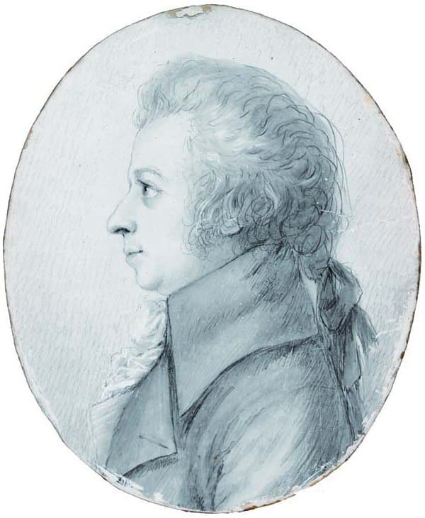
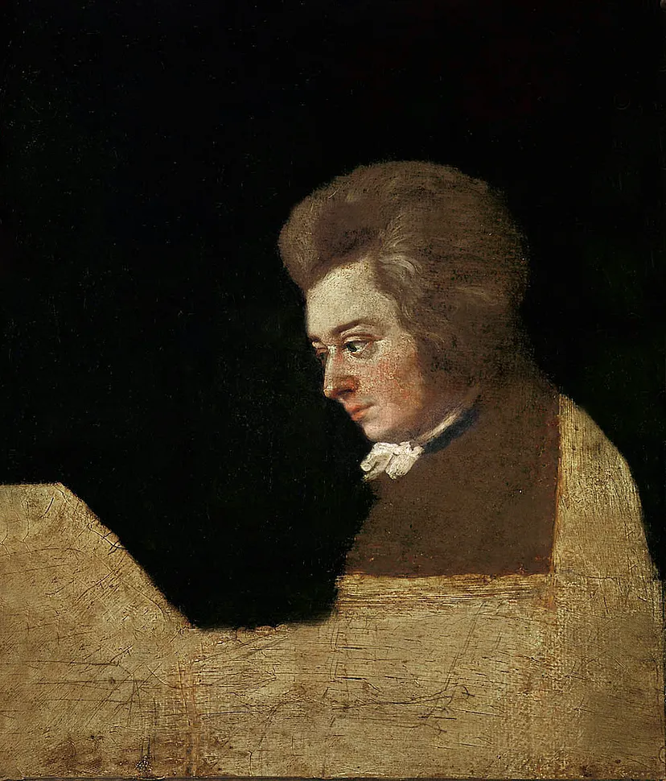

---

title: "7.4. 환상곡과 변주곡, 모차르트의 즉흥연주와 테크닉"

category: "바로크·고전"

order: 32

source_url: "https://m.dcinside.com/board/digitalpiano/2512"

source_post_no: 2512

images_expected: 2

images_downloaded: 2

status: "complete"

---

<!-- NOTION_SYNCED_TOP: 3b726dfb-cd79-808f-8ad4-d57f791ebb17 -->

1789년 봄, 베를린 연주 여행 중 4월 16일 또는 17일에 도라 슈토크가 상아판 위에 은첨필로 스케치함.

18세기 연주자에게 즉흥연주는 필수적인 역량이었으며, 모차르트 역시 주어진 주제나 아무런 준비 없이도 청중 앞에서 완결된 형식의 곡을 즉석에서 만들어낼 수 있었음.

모차르트의 작품들 중에서도 이러한 즉흥연주의 흔적과 자유로운 상상력이 가장 잘 드러나는 장르가 바로 환상곡(Fantasia)과 변주곡(Variations)임.

환상곡: 구조로부터의 자유

환상곡은 이름 그대로 작곡가의 ‘환상’에 따라, 엄격한 소나타 형식의 틀에서 벗어나 비교적 자유롭게 전개되는 작품을 말함. 모차르트가 남긴 세 개의 피아노 환상곡은 그의 즉흥연주 양식을 잘 보여줌.

가장 유명한 환상곡 D단조, K.397은 느리고 비통한 아르페지오로 시작하여, 격렬하고 빠른 패시지를 거쳐 마지막에는 밝은 분위기로 마무리되는 등, 의식의 흐름을 따라가듯 분위기 전환이 끊임없이 일어남. 

이 곡은 미완성으로 남았지만, 그의 제자가 만든 완성본 또는 다른 학자들이 완성한 악보로 연주되고 있음.

환상곡 C단조, K.475는 함께 출판된 C단조 소나타(K.457)의 서주 역할을 하는 작품으로 잦은 템포 변화, 적극적인 화성 진행, 침묵의 효과적인 사용, 그리고 오페라적인 레치타티보 악구 등을 통해 극적 대비와 불안한 정서를 표현함. 

변주곡: 장식과 변화의 예술

변주곡 장르는 모차르트가 자신의 피아노 연주 실력과 작곡 기법을 청중에게 과시하기에 좋은 형식이었음. 그는 주로 당시 유행하던 오페라 아리아나 다른 작곡가의 선율, 혹은 단순한 민요(“아, 어머니께 말씀드리죠”, 즉 ‘반짝반짝 작은 별’) 등을 주제로 삼아, 청중에게 친숙한 멜로디가 어떻게 화려하고 재치있게 변화하는지 보여줌.

모차르트 변주곡의 특징은 주제의 골격은 유지하면서, 그 위에 화려한 장식을 더하는 방식에 있음. 점차 빠른 음표(16분음표, 32분음표)를 사용하여 선율을 세분화하고, 아르페지오와 스케일을 삽입하며, 양손의 역할을 바꾸는 등 기교를 발휘함.

또한, 변주곡 세트 중간에는 거의 항상 같은 으뜸음의 단조(parallel minor)로 된 느린 변주를 삽입하여 분위기를 전환시켰고, 마지막 변주는 템포나 박자를 바꾸어(예: 미뉴에트나 지그 풍으로) 마무리하는 경우가 많았음.

환상곡과 변주곡은 모차르트가 형식적 통제와 즉흥적 상상력을 볼 수 있는 중요한 장르임.

Mozart at the Pianoforte. 1783년경 시작해 1789년경 캔버스를 확장한 미완성 초상화, 화가 Joseph Lange.

모차르트의 제자였던 요한 네포무크 훔멜은 스승을 “작은 체구에 창백한 얼굴, 유쾌하고 친근한 인상 속에 약간의 우울한 진지함이 담겨 있었으며, 큰 푸른 눈은 밝게 빛났다”고 묘사함.

[https://www.youtube.com/watch?v=VxmSJrzwNFk](https://www.youtube.com/watch?v=VxmSJrzwNFk)

Mozart's Fantasia in D minor, K. 397

피아노 : 글렌굴드

- dc official App

<!-- NOTION_SYNCED_BOTTOM: 2f126dfb-cd79-80c9-b783-d7e85011a79e -->
