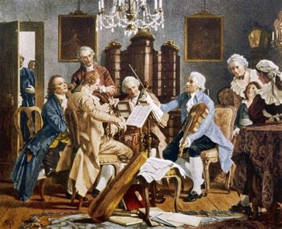

---

title: "8. 고전시대의 피아노 연주 기술과 제작 기술의 발전"

category: "바로크·고전"

order: 33

source_url: "https://m.dcinside.com/board/digitalpiano/2548"

source_post_no: 2548

images_expected: 1

images_downloaded: 1

status: "complete"

---

<!-- NOTION_SYNCED_TOP: 3b726dfb-cd79-808f-8ad4-d57f791ebb17 -->

작가 미상, 요제프 하이든이 실내악(현악 4중주)을 지휘하는 장면으로 비엔나의 Kunsthistorisches Museum(미술사 박물관) 소장

모차르트, 하이든과 같은 작곡가-연주자와 달리, 클레멘티·두세크·필드와 같은 인물들은 피아노라는 악기의 기계적·물리적 가능성에 더 큰 관심을 보였음.

이들은 연주자로서 피아노의 잠재력을 연구하며, 화려하고 고난도의 기교를 기반으로 한 새로운 연주 스타일을 발전시켰음. 그 과정에서 피아노 연주 테크닉의 확장과 제작 기술의 혁신이라는 두 축이 상호 자극하며 성장하는 흐름이 형성됨.

이들은 당시 유럽 전역에서 연주 여행을 하며, 새로운 작곡기법과 연주 테크닉으로 공연했고, 청중의 즉각적인 반응과 호응을 중시함. 이 흐름은 나중에 리스트와 쇼팽의 비르투오소 피아니즘으로 이어짐.

연주 테크닉과 피아노포르테 제작 기술은 상호 발전을 촉진하는 관계였으며, 특히 영국식 액션 피아노의 강한 음량과 넓어진 음역은 고난이도 기교를 뒷받침했고, 반대로 연주자의 새로운 테크닉은 악기의 기술적 진화를 가속시켰음.

- dc official App

<!-- NOTION_SYNCED_BOTTOM: 2f126dfb-cd79-80c9-b783-d7e85011a79e -->

