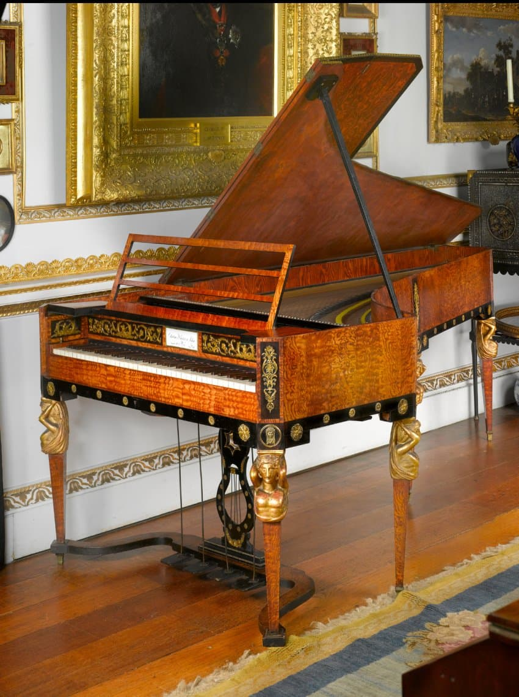
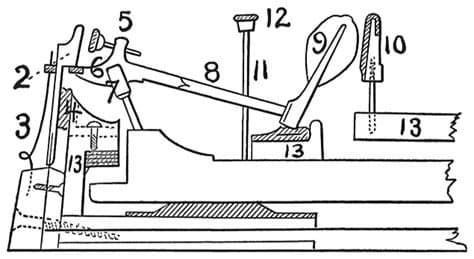

---

title: "8.2. 18세기 후반 피아노 제작 기술(빈 액션 vs영국 식 액션)"

category: "바로크·고전"

order: 35

source_url: "https://m.dcinside.com/board/digitalpiano/2568"

source_post_no: 2568

images_expected: 4

images_downloaded: 4

status: "complete"

---

<!-- NOTION_SYNCED_TOP: 3b726dfb-cd79-808f-8ad4-d57f791ebb17 -->

Cobbe Collection에 소장된 빈식 그랜드 피아노로, 안톤 발터의 작품으로 추정되는 Viennese grand piano (c. 1815).

18세기 후반, 피아노가 하프시코드를 대체하며 유럽의 주요 건반 악기로 자리 잡는 과정에서, 제작 기술은 크게 두 갈래의 흐름으로 발전했음. 

오스트리아 빈(Vienna)을 중심으로 한 '빈 액션(Viennese Action)’과 영국 런던을 중심으로 한 ‘영국 식 액션(English Action)’임. 

이 둘의 차이는 단순히 소리의 미묘한 차이를 넘어 건반의 터치감, 연주법, 그리고 작곡가들의 음악 스타일 자체에 깊은 영향을 미치는 근본적인 것이었음.

빈 액션 (Wiener Mechanik)

‘프렐메카니크(Prellmechanik)’라고도 불리는 빈 식 액션은 요한 안드레아스 슈타인(J.A. Stein)에 의해 완성되고 안톤 발터(A. Walter)와 같은 제작자들에 의해 발전되었음. 모차르트가 극찬하며 선호했던 것이 바로 이 방식임.

 \* 구조와 터치: 이 액션의 가장 큰 특징은 구조가 매우 가볍고 직접적이라는 것임. 해머가 건반의 뒷부분에 직접 연결되어 있어, 건반을 누르면 해머가 지렛대처럼 즉각적으로 튀어 올라 현을 때림. 그래서 터치가 매우 가볍고, 얕으며, 반응 속도가 매우 빨랐음. 연주자의 미세한 손가락 뉘앙스에 민감하게 반응하여 섬세한 표현이 가능했음.

 \* 음향적 특징: 해머가 가죽으로 덮여 있고 구조가 가벼워, 소리는 매우 맑고 투명하며, 각 음의 분리도가 뛰어났음. 하지만 전체적인 음량은 영국 식에 비해 작았고, 음의 지속(sustain) 또한 짧았음.

 \* 음악적 지향점: 이러한 특성은 모차르트나 초기 하이든의 음악에 이상적이었음. 맑고 투명한 음색은 그들의 명료한 선율과 섬세한 아티큘레이션을 표현하는 데 적합했고, 빠른 반응 속도는 고르고  빠른 스케일 연주에 최적화 됨.

영국 식 액션 (Englische Mechanik)

‘슈토스메카니크‘라고도 불리는 영국 식 액션은 스코틀랜드 출신 제작자 존 브로드우드(John Broadwood)에 의해 완성되었으며, 클레멘티와 같은 런던 악파 연주자들의 요구가 반영된 결과물임. 또한 현대 그랜드 피아노 액션의 원형임.

 \* 구조와 터치: 빈 식보다 더 복잡하고 견고한 구조를 가짐. 해머가 건반에 직접 연결되지 않고, 중간에 여러 개의 레버를 거쳐 더 큰 힘으로 현을 때리도록 설계되었음. 이로 인해 건반 터치는 더 깊고 무거웠으며, 타건시 더 많은 힘을 요구했음.

 \* 음향적 특징: 악기 프레임이 더 튼튼하고 현의 장력이 더 강했으며, 해머 역시 더 컸기 때문에 훨씬 더 크고, 깊으며, 힘 있는 소리를 냈음. 음의 지속 시간이 길어 레가토(legato) 연주에 유리했고, 셈여림의 폭(dynamic range)이 훨씬 넓어 여린 피아니시모에서 강력한 포르티시모까지 표현할 수 있었음.

 \* 음악적 지향점: 이러한 특성은 클레멘티나 뒤세크와 같은 런던 악파의 기교적이고 힘 있는 스타일에 잘 맞았음. 풍부한 페달의 사용, 강력한 화음, 그리고 오케스트라적인 음향을 추구했던 이들의 음악은 영국식 피아노의 특징을 잘 활용했음. 

Finchcocks Museum 소장, John Broadwood and Son 제작 1801년 산 그랜드 피아노, 전형적인 영국식 구조의 모습.

결론적으로, 빈 식 액션이 ‘명료함과 섬세함’을 추구했다면 영국 식 액션은 ‘힘과 풍부함’을 지향했음. 이 두 기술적 흐름은 고전주의 시대의 다양한 음악적 이상을 반영하는 것이었으며, 19세기로 넘어가면서 결국 더 큰 음량과 표현력을 가진 영국 식 액션이 피아노 제작의 표준으로 자리 잡음.

[https://www.youtube.com/watch?v=FZ4gMuOB2Uo](https://www.youtube.com/watch?v=FZ4gMuOB2Uo)

하이든의 런던 소나타들 (Hob. XVI / 50–52)

빈식과 영국식 포르테피아노로 같은 곡을 연주하며 구조에 따른 터치 및 음색의 차이를 비교할 수 있도록 구성한 영상

- dc official App

<!-- NOTION_SYNCED_BOTTOM: 2f126dfb-cd79-80c9-b783-d7e85011a79e -->

