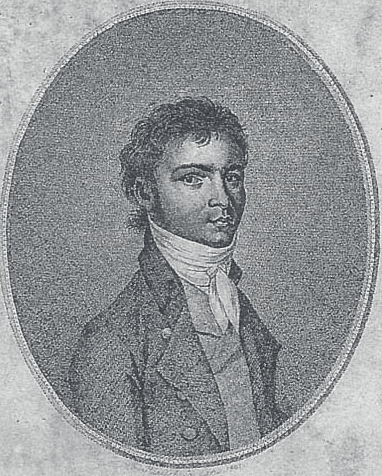
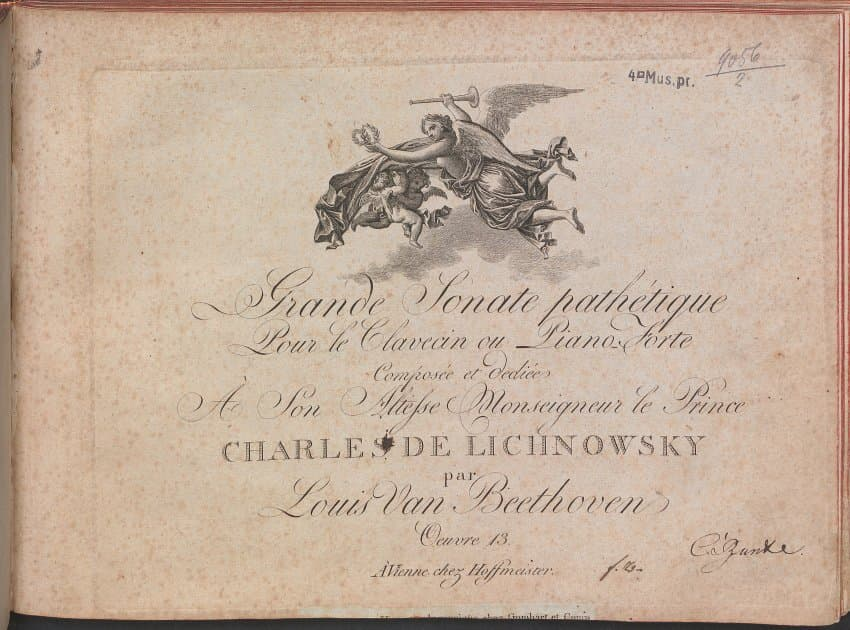

---

title: "9.1. 베토벤의 초기 피아노 소나타 (작품 2 ~ 작품 28)"

category: "바로크·고전"

order: 37

source_url: "https://m.dcinside.com/board/digitalpiano/2603"

source_post_no: 2603

images_expected: 3

images_downloaded: 3

status: "complete"

---

<!-- NOTION_SYNCED_TOP: 3b726dfb-cd79-808f-8ad4-d57f791ebb17 -->

젊은 시절의 베토벤: 빌리브로트 요제프 멜러가 그린 베토벤 초상화 (1803년경)

1792년, 젊은 베토벤은 빈으로 이주해 본격적인 음악활동을 시작했고, 작곡가로서보다 먼저, 압도적인 힘과 열정, 그리고 깊은 감정 표현을 특징으로 하는 피아노 연주자로 명성을 얻기 시작했음. 

베토벤의 피아노 소나타 창작 시기는 초기, 중기, 후기 세 단계로 나뉨. 초기 작품(작품 번호 2부터 28까지)은 하이든과 모차르트의 영향을 받으며 고전주의 형식에 충실하면서도 서서히 자신의 개성을 드러내는데,

1796년에 출판된 첫 작품인 피아노 소나타 작품 2 세 곡은 전통적인 3악장 구조 대신 4악장 구조를 채택하고, 미뉴에트 대신 스케르초를 도입하는 등 새로운 요소를 포함하고 있음. 또한 끊임없는 음량 변화와 스포르찬도 사용 등 강렬한 표현 기법을 보여줌.

비창 소나타 초판본 표지와 악보

초기 소나타의 모든 특징이 집약된 대표적인 소나타 8번 C단조 ‘Pathétique(비창)’, Op.13임. ‘Pathétique’의 곡은 당시로서는 드물게 1악장에 서주(Grave)를 포함하고 있는데, 이 서주는 단순한 도입이 아니라 악장 전체에서 중요한 역할을 함.

1악장은 소나타 형식으로 구성되어 있으며, 느리고 중후한 서주가 먼저 등장하고 이어지는 빠르고 격렬한 본악장(Allegro di molto e con brio) 중간에 이 서주가 두 차례 다시 나타나면서, 전체 악장이 통일된 비극적 분위기 아래 연결됨. 

이러한 구성은 당시 피아노 소나타에서 보기 드문 파격적인 방식으로 베토벤의 형식적 혁신성을 잘 보여줌.

이처럼 ‘Pathétique’ 소나타 1악장은 느린 도입부가 악장 전체와 긴밀하게 연관되어 있으며, 전체 작품을 하나의 아이디어 아래 모으는 역할을 한다는 점에서 베토벤 초기 작품의 특징과 천재성을 잘 드러내는 곡임.

‘Pathétique’라는 제목은 베토벤이 직접 붙였다는 설과 출판업자가 붙인 것이라는 설 등 몇가지 주장이 있지만, 당시  ‘Pathétique’라는 제목으로 출판된 것으로 미뤄 베토벤 본인의 어느정도 동의가 들어간 것만은 분명해 보임

또한 이 제목은 프랑스어 ‘Pathétique’에서 유래했는데, 원래 의미는 ‘비장한’이나 ‘장엄한’이 더 가깝고, ‘비창(悲愴)’은 일본식 오역이라는 해석도 있음.

‘비창’ 소나타는 베토벤이 20대 후반인 1798년경 작곡한 작품으로, 이 시기는 베토벤에게 청력 손실 초기 증상이 시작되던 때와 겹침. 당시 느꼈던 두려움과 고통, 내면의 비극적 정서가 곡의 전반에 흐르고 있다고 보며, ‘비창’이라는 제목도 이러한 감정 상태를 반영한 것으로 추정됨.

소나타 14번 C#  단조, Op.27-2은 베토벤이 “환상곡풍의 소나타(Sonata quasi una Fantasia)”라는 부제를 붙여 발표한 작품인데, 이또한  역시 형식 실험의 연장선상에 있음.

부제에서 알 수 있듯, 전통적인 소나타 형식에서 벗어나 보다 자유로운 표현과 구조를 시도한 곡임.

이 곡은 3악장으로 구성되어 있는데, 1악장은 느리고 서정적인 분위기로 시작하며 전통적인 빠르고 격렬한 소나타 악장은 마지막 3악장에 배치되어 있음.

1악장은 소나타 형식이 아닌 환상곡적인 성격을 띠며, 흐르는 듯한 아르페지오와 단순한 선율이 특징적임. 

이 곡에 ‘월광’(Moonlight)이라는 부제는 베토벤 사후 독일 평론가 루트비히 렐슈타프(Ludwig Rellstab)가 1830년대에 제1악장을 듣고 달빛 아래 호수에 떠 있는 배를 연상한다며 붙인 이름임.

이처럼 베토벤은 그의 초기 소나타들을 통해 고전주의의 유산을 완벽히 흡수함과 동시에, 그 형식의 틀을 자신의 강렬한 표현 의지에 맞게 확장하며, 새로운 음악적 서사 구조를 제시하는 혁신적인 시도를 보여줌.

[https://www.youtube.com/watch?v=SrcOcKYQX3c](https://www.youtube.com/watch?v=SrcOcKYQX3c)

Beethoven piano Sonata no.8

피아노 : 다니엘 바렌보임

- dc official App

<!-- NOTION_SYNCED_BOTTOM: 2f126dfb-cd79-80c9-b783-d7e85011a79e -->

