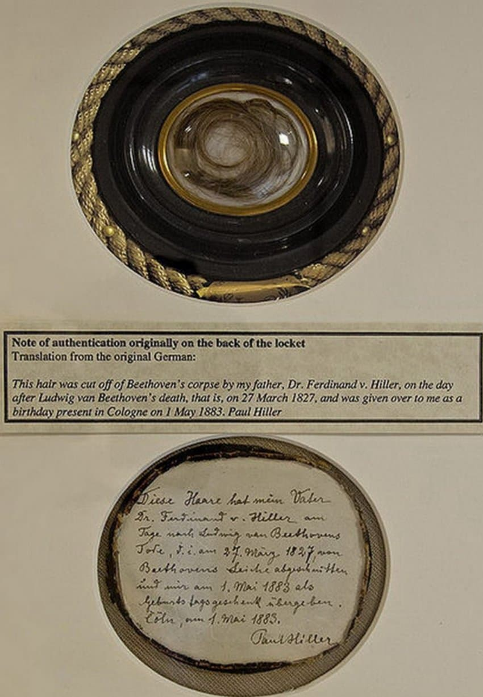

---

title: "9.3. 내면적이며 명상적인 베토벤 후기 작품"

category: "바로크·고전"

order: 39

source_url: "https://m.dcinside.com/board/digitalpiano/2638"

source_post_no: 2638

images_expected: 3

images_downloaded: 3

status: "complete"

---

<!-- NOTION_SYNCED_TOP: 3b726dfb-cd79-808f-8ad4-d57f791ebb17 -->

베토벤의 장례식, 비엔나 프란츠 스토버 작. 1827년

1810년대 후반, 베토벤은 완전히 청력을 상실함. 그 결과 외부 세계와의 소통이 어려워진 베토벤은, 후기 피아노 소나타에서 매우 개인적이고 실험적인 음악에 집중함.

이 시기 작품들은 형식 파괴, 대위법(푸가 등)과 변주곡 형식의 확대가 두드러지는데, 바흐, 헨델 등의 바로크 작곡가의 대위법을 적극적으로 수용했으며, 피아노의 확장된 음역과 음향을 최대한 활용함.

이것은 회귀가 아니라, 바로크의 대위법을 19세기 음악의 철학과 표현욕구에 맞게 혁신적이고 창조적으로 변용했다고 보는 것이 음악적 역사적으로 올바른 해석임.

이것은 고전주의의 형식 해체와 통합, 그리고 낭만주의적 감성의 확장이라는 맥락으로 평가되며, 브람스, 리스트,등 19~20세기 작곡가들이 베토벤 후기 대위법을 또다시 현대적으로 재해석하기도 함.

베토벤의 후기 작품이 더욱 내면적이며 명상적 성격의 작품이라는 것은 그의 친구, 제자, 가족의 증언과 자필 문서(필담책과 편지)에서 확인된 것으로 대중을 의식하지 않고, 개인적이고 철학적이며 실험적 작품 세계로 집중한 점이 두드러짐.

특히 후기 소나타, 현악 4중주 등에서 구조, 내용, 기법 면에서 대중성보다 창작 실험성과 깊은 심리적 내용이 강조됨.

후기 소나타의 특징인 ‘형식 해체’, 주제 공유, 악장 연결 등은 실제 작품 구조에 드러나는데, [Op.106](http://Op.106), 109, 110, 111 등 후기 소나타의 악장 배치, 동기적 결합, 주제 변형 등에서 찾을 수 있음.

Op.106 4악장(푸가), [Op.111](http://Op.111) 2악장(아리에타 변주곡) 등에서 변주곡 형식의 심화는 베토벤이 시간·공간 초월 및 인간 존재의 본질을 음악적으로 탐구하는 대표적 예로, 현대 음악 해설에서 자주 언급됨.

소나타 29번(함머클라비어)는 베토벤의 최장, 최대 규모 소나타로 마지막 악장에 복합적인 3성 푸가 도입으로 구조적·기술적 난도가 높아 고난도의 연주 기술과 대위법적 실험이 특징임.

이 시기 영국산 브로드우드(Broadwood) 등 대형 포르테피아노를 베토벤이 실제로 사용하게 되어, 후기 소나타의 넓은 음역 및 음색 변화가 나타남..

마지막 세 소나타(Op.109~111)는 낭만주의는 물론이고 현대 음악까지 미친 영향이 크며, 슈베르트, 리스트, 브람스, 쇼스타코비치 등 많은 후대 작곡가들이 베토벤 후기 소나타에서 창작의 영감을 얻음.

봉인된 베토벤의 머리카락 

1827년 3월 27일, 루트비히 판 베토벤이 사망한 다음 날, 페르디난트 힐러에 의해 베토벤의 시신에서 잘린 것임. 

앤디 워홀의 ‘베토벤’(1987).

[https://www.youtube.com/watch?v=RPsXRIc0bsw](https://www.youtube.com/watch?v=RPsXRIc0bsw)

Maria João Pires: Beethoven Sonata no. 32 in C minor, op. 111, II

피아노 : 마리아 피레스 

- dc official App

<!-- NOTION_SYNCED_BOTTOM: 2f126dfb-cd79-80c9-b783-d7e85011a79e -->

