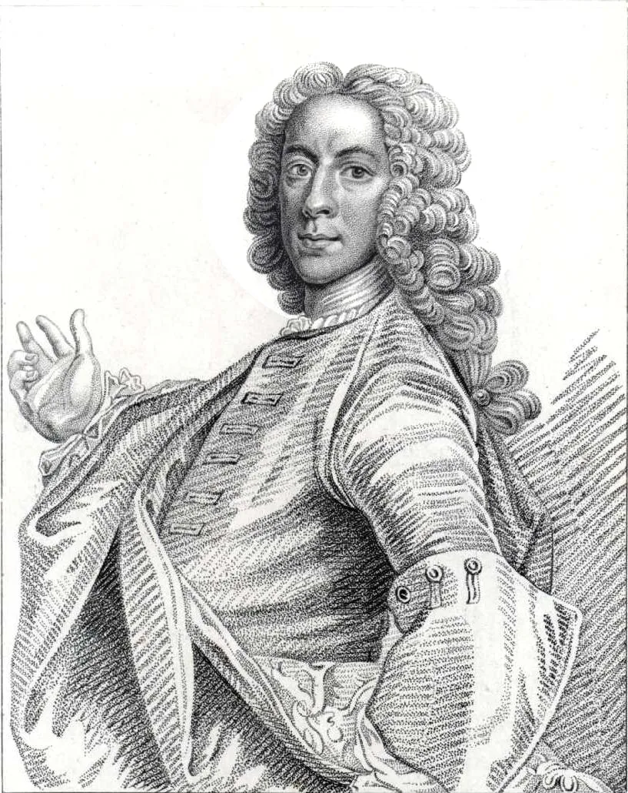

---

title: "음악의 아버지 어머니를 모두 죽인 음악의 원수"

category: "작곡가 이야기"

order: 1

source_url: "https://m.dcinside.com/board/digitalpiano/2200"

source_post_no: 2200

images_expected: 1

images_downloaded: 1

status: "complete"

---

<!-- NOTION_SYNCED_TOP: 3b726dfb-cd79-808f-8ad4-d57f791ebb17 -->

그것은 바로 존 테일러 직업은 외과 의사(돌팔이)

동갑내기 음악가 바흐와 헨델을 저세상으로 보내버린 희대의 킬러

<!-- NOTION_SYNCED_BOTTOM: 2f126dfb-cd79-80c9-b783-d7e85011a79e -->

