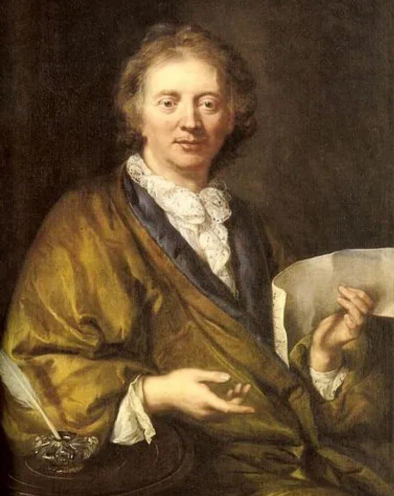
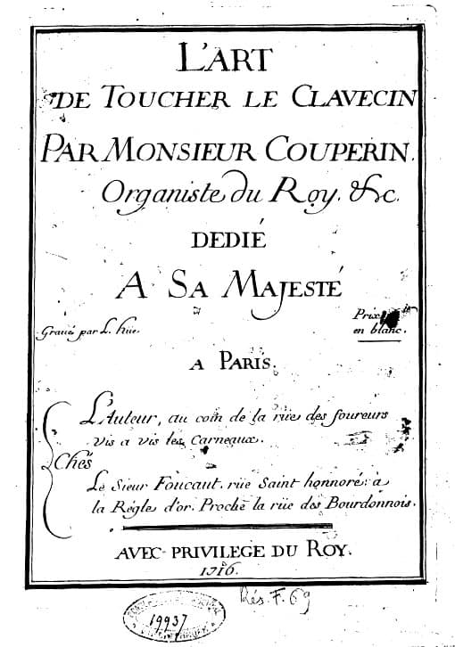

---

title: "바로크 번외. 프랑수아 쿠플랭"

category: "작곡가 이야기"

order: 2

source_url: "https://m.dcinside.com/board/digitalpiano/2717"

source_post_no: 2717

images_expected: 2

images_downloaded: 2

status: "complete"

---

<!-- NOTION_SYNCED_TOP: 3b726dfb-cd79-808f-8ad4-d57f791ebb17 -->

쿠플랭 초상화(바로크 시대 가발 없는 보기 드문 초상) 

프랑수아 쿠플랭(1668~1733)은 1713~1730년 사이에 네 권의 클라브생 작품집 《Les Pièces de clavecin》을 출간함. 

각 권은 여러 ‘오르드(ordre)’로 구성되었는데, 각각의 오르드는 춤곡 중심의 독일·영국식 모음곡과 달리, 표제가 붙은 캐릭터 피스나 인물,장면을 묘사한 곡이 자유롭게 섞여 있음.

‘오르드’는 모음곡(suite)과 유사하지만, 춤곡 순서를 엄격히 지키지 않고 작곡가가 원하는 성격곡을 자유롭게 배치한 형식임.

전통적인 바로크 시대 모음곡(suite)은 알르망드, 쿠랑트, 사라방드, 지그 등 주요 춤곡을 일정한 순서와 한 조성으로 배열하며, 곡 제목 역시 단순한 춤곡 이름으로만 표기하는 경우가 많음.

각 곡은 실제 춤을 추기보다는 춤의 리듬과 성격을 살린 순수 기악곡이며, 전체적으로 ‘무표제’(non-programmatic) 성향임.

이에 비해 쿠플랭의 ‘오르드(ordre)’는 표제곡과 춤곡을 자유롭게 섞고, 각각의 곡에 성격·인물·상황 등 구체적인 제목을 붙이며, 곡의 순서나 구성을 엄격히 정하지 않음.

세밀한 장식법과 연주 지침까지 명시해 프랑스식 표제 건반 모음곡이라는 독창적 양식을 만들어냈다는데 큰 의미가 있음.

쿠플랭은 프랑스 하프시코드 음악의 세련된 장식음, 프레이징을 발전시켰으며, 연주법과 장식기호, 운지법 등을 《클라브생 연주법》(L’art de toucher le clavecin)에 명확하게 기록해 연주자의 해석을 구체적으로 안내함.

쿠플랭의 음악은 궁정의 세련됨과 예술적 표현력이 담겨 있으며, 이러한 자유로운 표제 구조와 세밀한 연주지침은 바흐와 헨델의 건반 음악과 뚜렷한 차이를 보임.

쿠플랭은 프랑스 건반음악의 예술적 완성도를 높였고, 라모(Jean-Philippe Rameau) 등 후대 작곡가에게 큰 영향을 줌.

[https://www.youtube.com/watch?v=1I1BpoxHS3k](https://www.youtube.com/watch?v=1I1BpoxHS3k)

Les Barricades Mystérieuses (신비로운 바리케이드)

베르사유 궁전의 거울의 방, 알렉상드르 타로(피아노)

- dc official App

<!-- NOTION_SYNCED_BOTTOM: 2f126dfb-cd79-80c9-b783-d7e85011a79e -->

