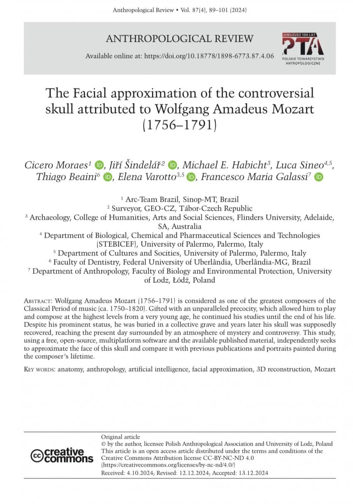
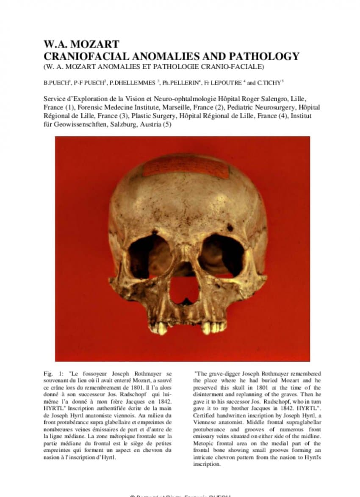
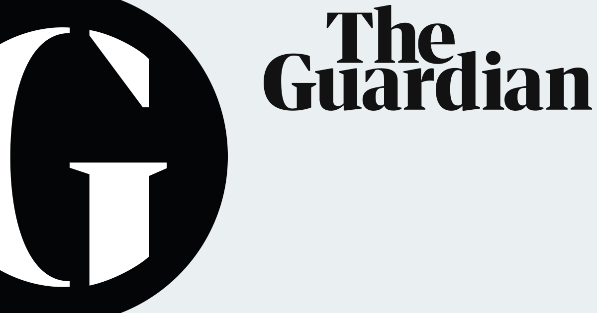

---

title: "모차르트의 두개골로(추정) 3D 얼굴 복원"

category: "작곡가 이야기"

order: 4

source_url: "https://m.dcinside.com/board/digitalpiano/2672"

source_post_no: 2672

images_expected: 12

images_downloaded: 12

status: "complete"

---

<!-- NOTION_SYNCED_TOP: 3b726dfb-cd79-808f-8ad4-d57f791ebb17 -->

모차르트의 두개골로 추정되는 골격을 바탕으로, 디지털 기반의 3D 얼굴 복원을 시도한 연구

아래 논문 링크

[https://www.researchgate.net/publication/388313462\_The\_Facial\_approximation\_of\_the\_controversial\_skull\_attributed\_to\_Wolfgang\_Amadeus\_Mozart\_1756-1791](https://www.researchgate.net/publication/388313462_The_Facial_approximation_of_the_controversial_skull_attributed_to_Wolfgang_Amadeus_Mozart_1756-1791)

모차르트는 사후 개인 묘에 묻혔지만, 나중에 다른 묘를 만들 공간을 마련하기 위해 파묘되어 공동 묘지로 옮겨짐. 아마도 이때 누군가가 그의 두개골을 보관했고, 이후 여러 차례 소유자가 바뀜. 1895년쯤 사라졌다가 1901년 하이르틀 재단에서 ‘재발견’되어 이듬해 잘츠부르크 모차르테움에 공식 기증됨.

물론 이 이야기가 100%추적 가능한 사실은 아님. 

또한 2006~2012년 사이 오스트리아 과학 아카데미와 국제 연구진이 협력해 유전적 검사를 진행. 모차르트 가족이 묻힌 잘츠부르크 성 세바스티안 묘지에 있는 친척들의 뼈가 주요 비교 대상이었음.

하지만, 서로 일치하지 않고, 두개골이 진짜인지, 유골이 진짜인지 모두 확신 불가. ”결정적 증거 없음“이라고 결론남.

아래 가디언지 기사.

[**DNA detectives discover more skeletons in Mozart family closet**](https://www.theguardian.com/world/2006/jan/09/arts.music)

[Scientists reveal results of tests on skull unearthed by Viennese gravedigger.](https://www.theguardian.com/world/2006/jan/09/arts.music)

[www.theguardian.com](https://www.theguardian.com/world/2006/jan/09/arts.music)

이 논문은 이 두개골이 모차르트가 맞다는 가정하에

역사적으로 그림을 그린 장소와 사실이 확인된 아래의 은필 초상화와 아내 콘스탄체가 본인과 닮았다고 인정한 1783년 요제프 랑게의 미완성 초상화를 비교하여 복원함.

1789년 봄, 베를린 연주 여행 중 4월 16일 또는 17일에 도라 슈토크가 상아판 위에 은첨필로 스케치함.

요제프 랑게. 1783년경 시작해 1789년경 캔버스를 확장한 미완성 초상화,

복원 결과물과 과정

- dc official App

<!-- NOTION_SYNCED_BOTTOM: 2f126dfb-cd79-80c9-b783-d7e85011a79e -->
