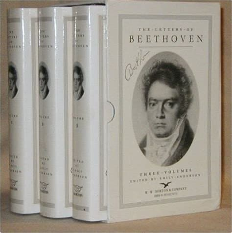
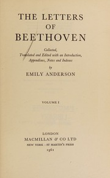
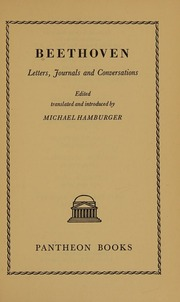

---

title: "베토벤 편지 모음집"

category: "작곡가 이야기"

order: 6

source_url: "https://m.dcinside.com/board/digitalpiano/1415"

source_post_no: 1415

images_expected: 5

images_downloaded: 5

status: "complete"

---

<!-- NOTION_SYNCED_TOP: 3b726dfb-cd79-808f-8ad4-d57f791ebb17 -->

제일 좋은건 이거

에밀리 앤더슨이 편집한

The Letters of Beethoven

3권 세트

이 책이 베토벤의 거의 모든 편지를 수록하고 있고

각 편지에 대한 배경 설명

그리고 작곡 배경에 대한 주석도 있어서 좋음.

아래 링크 가서 회원 가입하면

15간 대출 가능하고 온러인으로 열람 가능.

[**THE LETTERS OF BEETHOVEN: VOLS. I - III. : Ludwig van Beethoven; Emily Anderson : Free Download, Borrow, and Streaming : Internet Archive**](https://archive.org/details/lettersofbeethov0001ludw)

[THE LETTERS OF BEETHOVEN: VOLS. I - III. : Ludwig van Beethoven; Emily Anderson : Free Download, Borrow, and Streaming : Internet Archive](https://archive.org/details/lettersofbeethov0001ludw)

[archive.org](https://archive.org/details/lettersofbeethov0001ludw)

두 번째는 

[**Letters, journals, and conversations : Beethoven, Ludwig van, 1770-1827 : Free Download, Borrow, and Streaming : Internet Archive**](https://archive.org/details/lettersjournalsc0000beet)

[281 pages : 22 cm](https://archive.org/details/lettersjournalsc0000beet)

[archive.org](https://archive.org/details/lettersjournalsc0000beet)

Letters, journals, and conversations

이 책은 편지뿐 아니라 당시 나누었던 대화도 있는데

주로 베토벤의 심리적 상태에 대한 얘기가 많음.

이것도 회원 가입하면 15일 대여 가능

새번째

Project Gutenberg이 편짖하

Beethoven’s Letters

루트비히 노엘이 수집한 베토벤의 편지를

한정으로 번역한 것임.

좀 베토벤 정말 천재에요. 수준의 위인전기 같음.

인간적인 얘기도 있고.

아래 두개의 링크, 두권으로 구성됨.

[**BEETHOVEN'S LETTERS. (1790--1826.) VOL. I.**](https://www.gutenberg.org/files/13065/13065-h/13065-h.htm)

[BEETHOVEN'S LETTERS. (1790--1826.) VOL. I.](https://www.gutenberg.org/files/13065/13065-h/13065-h.htm)

[www.gutenberg.org](https://www.gutenberg.org/files/13065/13065-h/13065-h.htm)

[**BEETHOVEN'S LETTERS. (1790--1826.) VOL. II.**](https://www.gutenberg.org/files/13272/13272-h/13272-h.htm)

[BEETHOVEN'S LETTERS. (1790--1826.) VOL. II.](https://www.gutenberg.org/files/13272/13272-h/13272-h.htm)

[www.gutenberg.org](https://www.gutenberg.org/files/13272/13272-h/13272-h.htm)

이 책은 가서 링크만 열면 텍스트를 바로 열어서 볼 수 있어서 편함.

- dc official App

<!-- NOTION_SYNCED_BOTTOM: 2f126dfb-cd79-80c9-b783-d7e85011a79e -->

