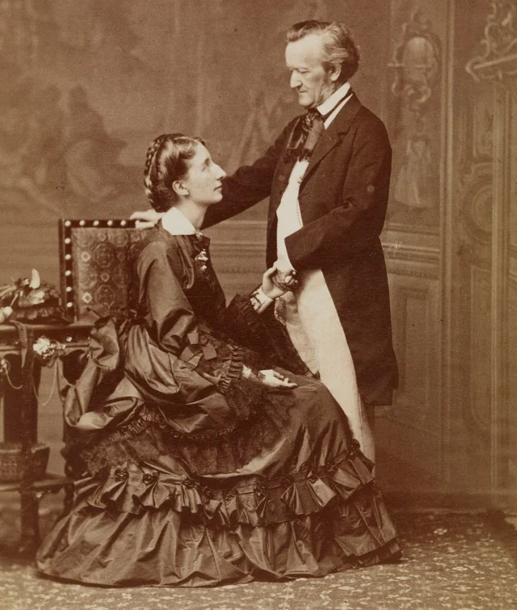
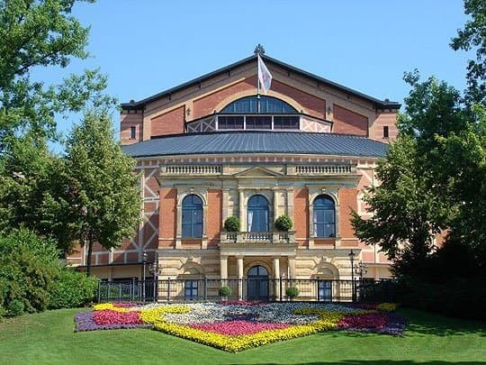
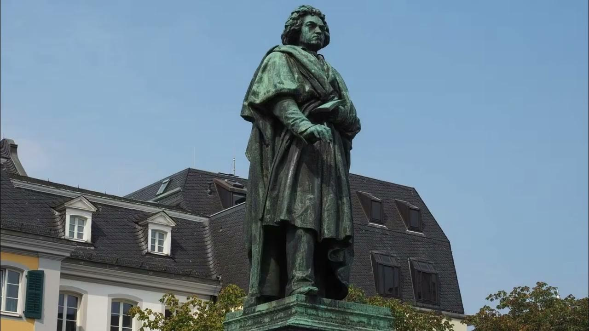

---

title: "작곡가들의 수입 (리스트 6. 끝)"

category: "작곡가 이야기"

order: 24

source_url: "https://m.dcinside.com/board/digitalpiano/4701"

source_post_no: 4701

images_expected: 6

images_downloaded: 6

status: "complete"

---

<!-- NOTION_SYNCED_TOP: 3b726dfb-cd79-808f-8ad4-d57f791ebb17 -->

1864년 3월, 바그너는 비엔나에서 빚쟁이들을 피해 야반도주해서 슈투트가르트에 숨어있던 중 5월에 바이에른 국왕 루트비히 2세의 구조를 받아 빚을 청산하고 뮌헨에 정착함.

바그너는 자신의 작품을 지휘해 달라며 뷜로를 뮌헨으로 부르면서, 비서 역할과 음악 활동 보조를 위해 코지마도 함께 와 달라고 부탁함. 

남편 뷜로가 베를린에서 신변 정리를 하느라 늦는 사이, 코지마가 아이들을 데리고 1864년 6월 29일 뮌헨에 먼저 도착함. 바그너와 코지마는 슈타른베르크 호숫가 펠레트 별장에서 지냄.

당시 별장에서 일하던 하녀(안나)와 하인(프란츠)은 훗날 이혼 소송 관련 법정 증언에서 "코지마 부인과 바그너의 관계는 이무렵부터 시작되었다"라고 진술함.

뷜로는 7월에야 뮌헨에 도착해 왕실 지휘자로서의 업무와 트리스탄과 이졸데 공연 준비로 극도로 바빴음.

그리고 1865년 4월 10일, 코지마가 딸을 출산했는데, 이름을 이졸데(Isolde)라고 지음.

출산일로부터 역산하면 임신 시기는 1864년 6~7월경으로, 코지마가 펠레트 별장에서 바그너와 단둘이 지내던 시기와 일치함.

이때부터 리스트를 비롯한 주변 모두가 둘 사이를 드러내놓고 의심했지만, 뷜로는 알면서도 모른척하며 지냄.

뷜로의 어머니 프란치스카가 왜 복수하지 않느냐고 다그치는

편지에, 

"만약 그가 리하르트 바그너가 아닌 다른 사람이었다면, 나는 그를 쏘아 죽였을 것입니다."

라고 회신한 걸 보면 뷜로도 둘의 사이를 알고 있었음.

둘의 관계는 지속되었고 1867년 2월, 차녀 에바(Eva)가 태어남. 그리고, 스캔들이 걷잡을 수 없이 커지자 1868년 11월, 코지마는 딸들을 데리고 바그너가 머물던 스위스 트립셴으로 거처를 옮기며 가출함.

뷜로는 가정을 지키고자 돌아오라고 설득했으나, 1869년 6월 아들 지크프리트(Siegfried)가 태어나자 결국 포기함. 

뷜로는 1870년 7월 이혼에 합의했고, 그해 8월 바그너와 코지마는 정식으로 결혼함.

바이로이트 축제 극장.

재혼 후 두 사람은 바그너의 숙원 사업인 바이로이트 축제 극장 건립과 축제 준비에 매진함.

1886년, 코지마는 축제의 흥행과 권위를 위해 아버지 리스트의 참석이 필수적이라 판단하여 초청함.

당시 75세였던 리스트는 건강이 좋지 않았음에도 딸의 요청을 거절하지 못하고 룩셈부르크에서 기차를 타고 무리하게 이동함.

이 과정에서 심한 감기에 걸렸고, 바이로이트에 도착했을 때는 이미 폐렴으로 악화된 상태였음.

리스트는 바그너 가문의 저택이 아닌, 바로 옆의 하인 숙소 임대 주택에서 앓아누웠고,

1886년 7월 31일, 리스트는 그곳에서 사망함

리스트가 사망하자 코지마는 리스트의 임종을 지키던 제자 리나 슈말하우젠을 쫓아내고, 그녀가 가지고 있던 리스트의 일기장과 메모 등 개인 기록물을 전부 압수함.

또 다른 제자인 아우구스트 괼레리히의 증언에 따르면, 축제 분위기를 망치지 않기 위해 리스트의 부고는 조용히 처리되었으며, 그는 충분히 애도받지 못했다. 라고 함.

코지마는 리스트의 남은 유산과 저작권을 모두 차지했는데,바그너와 리스트가 주고받은 서신들을 검토하면서 바그너가 비굴하게 굴거나 인격적으로 결함이 드러나는 굴욕적인 편지들은 대부분 소각한 것으로 추정됨.

앞서 언급했듯 현재 남아있는 서신 중 약 40%가 금전 요구인 점을 감안하면, 소각된 편지들에는 훨씬 더 노골적이고 많은 액수의 돈을 빌려달라는 내용이 담겨 있었을 것으로 보임.

리스트는 항상 헝가리에 묻히거나, 혹은 평생의 반려자인 카롤리네 공작부인이 있는 로마 에 묻히길 원했고, 유산 또한 카롤리네에게 남기려 했으나 코지마의 법적 개입으로 무산됨.

코지마는 아버지가 이곳에 있어야 바이로이트가 예술의 성지가 된다며 리스트를 바이로이트 시립 묘지에 안장함.

결과적으로 리스트의 막대한 저작권 수입과 자료, 그리고 묘지라는 상징성까지 모두 바그너 가문으로 흘러들어감.

리스트가 바그너에게 끊임없이 송금하던 시기, 정작 리스트 본인의 재정 상태가 풍족했던 것은 아님. 

리스트는 재능과 부는 사회에 환원해야 한다는 신념으로 평생 상당한 기부를 이어왔기 때문임.

대표적인 사례가 베토벤 동상 건립 기금임.

(아래 동상 건립 관련 다큐멘터리)

[**SWR 12.08.1845: Das Beethoven-Denkmal in Bonn wird enthüllt**](https://youtu.be/S16Dq1iTi_U?si=tOO0FPWfeqUAxf7o)

[Das Denkmal auf dem Bonner Münsterplatz ist ein Magnet für Touristen und ein Wahrzeichen, das an den größten Sohn der Stadt erinnert.Marie-Christine Werner](https://youtu.be/S16Dq1iTi_U?si=tOO0FPWfeqUAxf7o)

[youtu.be](https://youtu.be/S16Dq1iTi_U?si=tOO0FPWfeqUAxf7o)

1839년, 독일 본(Bonn)에서 추진하던 베토벤 기념비 건립 사업이 모금 부족으로 무산 위기에 처함. 소식을 들은 리스트는 부족한 금액 전액(약 1만 프랑 이상)을 사비로 쾌척하여 1845년 동상 제막식을 성사시킴.

또한 1838년 헝가리 대홍수 때는 비엔나에서 자선 콘서트를 열어 역사상 최대 규모의 수익금을 조국 수재민들에게 기부했으며, 쾰른 대성당 완공 사업 등 명분 있는 곳에는 항상 거액을 후원함.

바이마르 거주 시절(바그너를 돕던 시기)에는 전 세계에서 찾아온 제자들을 가르쳤으나 레슨비를 거의 받지 않고 가난한 제자들에게는 생활비를 주거나 식사를 제공하기도 함.

리스트와 제자들.

예술의 모든 역사를 통틀어, 프란츠 리스트보다 더 고귀하고, 더 이타적인 사람을 찾기는 어려울 것이다.

- 어니스트 뉴먼 (Ernest Newman, 영국의 음악 평론가이자 바그너 연구가)

- dc official App

<!-- NOTION_SYNCED_BOTTOM: 2f126dfb-cd79-80c9-b783-d7e85011a79e -->

